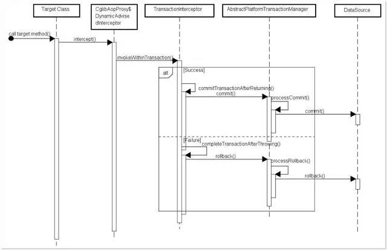
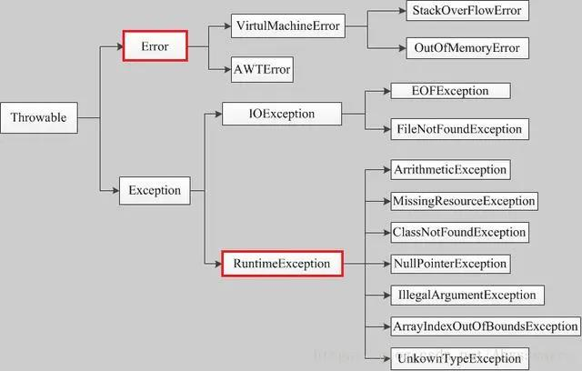

<b style="color: orangered">一.事务</b>
&nbsp;&nbsp;&nbsp;&nbsp;事务管理在系统开发中是不可缺少的一部分，Spring提供了很好事务管理机制，主要分为编程式事务和声明式事务两种。<!-- more -->
&nbsp;&nbsp;&nbsp;&nbsp;<b style="color: #6A6AFF">编程式事务：</b>是指在代码中手动的管理事务的提交、回滚等操作，代码侵入性比较强，如下示例：
```java
try {
    // TODO something
    transactionManager.commit(status);
} catch (Exception e) {
    transactionManager.rollback(status);
    throw new InvoiceApplyException("异常失败");
}
```
&nbsp;&nbsp;&nbsp;&nbsp;<b style="color: #6A6AFF">声明式事务：</b>基于AOP面向切面，它将具体业务与事务处理部分解耦，代码侵入性很低，所以在实际开发中声明式事务用的比较多。声明式事务也有两种实现方式：一是基于TX和AOP的XML配置文件方式，二是就是基于@Transactional注解了。
```java
@Transactional
@GetMapping("/test")
public String test() {
    int insert = testService.insert(test);
}
```
<b style="color: orangered">二.@Transactional介绍</b>
&nbsp;&nbsp;&nbsp;&nbsp;<b style="color: #6A6AFF">1.@Transactional注解可以作用于哪些地方？</b>
&nbsp;&nbsp;&nbsp;&nbsp;&nbsp;&nbsp;&nbsp;&nbsp;@Transactional可以作用在接口、类、类方法。
&nbsp;&nbsp;&nbsp;&nbsp;&nbsp;&nbsp;&nbsp;&nbsp;<b style="color: #00FFFF">作用于类：</b>当把@Transactional注解放在类上时，表示所有该类的public方法都配置相同的事务属性信息。
&nbsp;&nbsp;&nbsp;&nbsp;&nbsp;&nbsp;&nbsp;&nbsp;<b style="color: #00FFFF">作用于方法：</b>当类配置了@Transactional，方法也配置了@Transactional，方法的事务会覆盖类的事务配置信息。
&nbsp;&nbsp;&nbsp;&nbsp;&nbsp;&nbsp;&nbsp;&nbsp;<b style="color: #00FFFF">作用于接口：</b>不推荐使用这种方法，因为一旦标注在Interface上并且配置了Spring AOP使用CGLib动态代理，将会导致@Transactional注解失效。
```java
@Transactional
@RestController
@RequestMapping
public class MybatisPlusController {
    @Autowired
    private CityInfoDictMapper cityInfoDictMapper;
		
    @Transactional(rollback=Exception.class)
    @GetMapping("/test")
    public String test() throws Exception {
        CityInfoDict cityInfoDict = new CityInfoDict();
        cityInfoDict.setParentCityId(2);
        cityInfoDict.setCityName("泉州");
        cityInfoDict.setCityLevel(2);
        cityInfoDict.setCityCode(2);
        int insert = cityInfoDictMapper.insert(cityInfoDict);
        return insert + "";
    }
}
```
&nbsp;&nbsp;&nbsp;&nbsp;<b style="color: #6A6AFF">2.@Transactional注解有哪些属性</b>
&nbsp;&nbsp;&nbsp;&nbsp;&nbsp;&nbsp;&nbsp;&nbsp;<b style="color: #00FFFF">propagation属性</b>
&nbsp;&nbsp;&nbsp;&nbsp;&nbsp;&nbsp;&nbsp;&nbsp;&nbsp;&nbsp;&nbsp;&nbsp;propagation代表事务的传播行为，默认值为Propagation.REQUIRED，其他的属性信息如下：
&nbsp;&nbsp;&nbsp;&nbsp;&nbsp;&nbsp;&nbsp;&nbsp;&nbsp;&nbsp;&nbsp;&nbsp;Propagation.REQUIRED:如果当前存在事务，则加入该事务，如果当前不存在事务，则创建一个新的事务。(也就是说如果A方法和B方法都添加了注解，在默认传播模式下，A方法内部调用B方法，会把两个方法的事务合并为一个事务)
&nbsp;&nbsp;&nbsp;&nbsp;&nbsp;&nbsp;&nbsp;&nbsp;&nbsp;&nbsp;&nbsp;&nbsp;Propagation.SUPPORTS:如果当前存在事务，则加入该事务；如果当前不存在事务，则以非事务的方式继续运行。
&nbsp;&nbsp;&nbsp;&nbsp;&nbsp;&nbsp;&nbsp;&nbsp;&nbsp;&nbsp;&nbsp;&nbsp;Propagation.MANDATORY:如果当前存在事务，则加入该事务；如果当前不存在事务，则抛出异常。
&nbsp;&nbsp;&nbsp;&nbsp;&nbsp;&nbsp;&nbsp;&nbsp;&nbsp;&nbsp;&nbsp;&nbsp;Propagation.REQUIRES_NEW:重新创建一个事务，如果当前存在事务，暂停当前的事务。(当类A的中a方法用默认的Propagation.REQUIRED模式，类B中的b方法加上采用Propagation.REQUIRE_NEW模式，然后在a方法中调用b方法操作数据库，然而a方法抛出异常后，b方法并没有进行回滚，因为Propagation.REQUIRES_NEW会暂停a方法的事务)
&nbsp;&nbsp;&nbsp;&nbsp;&nbsp;&nbsp;&nbsp;&nbsp;&nbsp;&nbsp;&nbsp;&nbsp;Propagation.NOT_SUPPORTED:以非事务的方式运行，如果当前存在事务，暂停当前的事务。
&nbsp;&nbsp;&nbsp;&nbsp;&nbsp;&nbsp;&nbsp;&nbsp;&nbsp;&nbsp;&nbsp;&nbsp;Propagation.NEVER:以非事务的方式运行，如果当前存在事务，则抛出异常。
&nbsp;&nbsp;&nbsp;&nbsp;&nbsp;&nbsp;&nbsp;&nbsp;&nbsp;&nbsp;&nbsp;&nbsp;Propagation.NESTED:跟Propagation.REQUEIRED效果一样。
&nbsp;&nbsp;&nbsp;&nbsp;&nbsp;&nbsp;&nbsp;&nbsp;<b style="color: #00FFFF">isolation属性</b>
&nbsp;&nbsp;&nbsp;&nbsp;&nbsp;&nbsp;&nbsp;&nbsp;&nbsp;&nbsp;&nbsp;&nbsp;isolation:事务的隔离级别，默认值为Isolation.DEFAULT。
&nbsp;&nbsp;&nbsp;&nbsp;&nbsp;&nbsp;&nbsp;&nbsp;&nbsp;&nbsp;&nbsp;&nbsp;Isolation.DEFAULT:使用底层数据库默认的隔离级别。
&nbsp;&nbsp;&nbsp;&nbsp;&nbsp;&nbsp;&nbsp;&nbsp;&nbsp;&nbsp;&nbsp;&nbsp;Isolation.READ_UNCOMMITED
&nbsp;&nbsp;&nbsp;&nbsp;&nbsp;&nbsp;&nbsp;&nbsp;&nbsp;&nbsp;&nbsp;&nbsp;Isolation.READ_COMMITED
&nbsp;&nbsp;&nbsp;&nbsp;&nbsp;&nbsp;&nbsp;&nbsp;&nbsp;&nbsp;&nbsp;&nbsp;Isolation.REPEATABLE_READ
&nbsp;&nbsp;&nbsp;&nbsp;&nbsp;&nbsp;&nbsp;&nbsp;&nbsp;&nbsp;&nbsp;&nbsp;Isolation.SERIALIZABLE
&nbsp;&nbsp;&nbsp;&nbsp;&nbsp;&nbsp;&nbsp;&nbsp;<b style="color: #00FFFF">timeout属性</b>
&nbsp;&nbsp;&nbsp;&nbsp;&nbsp;&nbsp;&nbsp;&nbsp;&nbsp;&nbsp;&nbsp;&nbsp;timeout：事务的超时时间，默认值为-1.如果超过改时间限制但事务还没有完成，则自动回滚事务。
&nbsp;&nbsp;&nbsp;&nbsp;&nbsp;&nbsp;&nbsp;&nbsp;<b style="color: #00FFFF">readOnly属性</b>
&nbsp;&nbsp;&nbsp;&nbsp;&nbsp;&nbsp;&nbsp;&nbsp;&nbsp;&nbsp;&nbsp;&nbsp;readOnly：指定事务是否为只读事务，默认值为false；为了忽略那些不需要事务的方法，比如读取数据，可以设置read-only为true。
&nbsp;&nbsp;&nbsp;&nbsp;&nbsp;&nbsp;&nbsp;&nbsp;<b style="color: #00FFFF">rollbackFor属性</b>
&nbsp;&nbsp;&nbsp;&nbsp;&nbsp;&nbsp;&nbsp;&nbsp;&nbsp;&nbsp;&nbsp;&nbsp;rollbackFor：用于指定能够触发事务回滚的异常类型，可以指定多个异常类型。
&nbsp;&nbsp;&nbsp;&nbsp;&nbsp;&nbsp;&nbsp;&nbsp;<b style="color: #00FFFF">noRollbackFor属性</b>
&nbsp;&nbsp;&nbsp;&nbsp;&nbsp;&nbsp;&nbsp;&nbsp;&nbsp;&nbsp;&nbsp;&nbsp;noRollbackFor：抛出指定的异常类型，不回滚事务，也可以指定多个异常类型。
<b style="color: orangered">三.@Transactional失效场景</b>
&nbsp;&nbsp;&nbsp;&nbsp;<b style="color: #6A6AFF">1.@Transactional应用在非public修饰的方法上</b>
&nbsp;&nbsp;&nbsp;&nbsp;&nbsp;&nbsp;&nbsp;&nbsp;如果Transactional注解应用在非public修饰的方法上，Transactional将会失效。

&nbsp;&nbsp;&nbsp;&nbsp;&nbsp;&nbsp;&nbsp;&nbsp;之所以会失效是因为在Spring AOP代理时，如上图所示TransactionInterceptor(事务拦截器)在目标方法执行前后进行拦截，DynamicAdvisedInterceptor(CglibAopProxy的内部类)的intercept方法或JdkDynamicAopProxy的invoke方法间接调用AbstractFallbackTransactionAttributeSource的computeTransactionAttribute方法，获取Transactional注解的实物配置信息。
```java
protected TransactionAttribute computeTransactionAttribute(Method method, Class<?> targetClass) {
    // Don't allow no-public methods as requrired.
    if(allowPublicMethodsOnly() && !Modifier.isPublic(method.getModifiers())) {
        return null;
    }
}
```
&nbsp;&nbsp;&nbsp;&nbsp;&nbsp;&nbsp;&nbsp;&nbsp;此方法会检查目标方法的修饰符是否为public，不是public则不会获取@Transactional的属性配置信息。
&nbsp;&nbsp;&nbsp;&nbsp;&nbsp;&nbsp;&nbsp;&nbsp;<b style="color: red">注意：protected、private修饰的方法上使用@Transactional注解，虽然事务无效，但不会有任何报错，这是我们很容易犯错的一点。</b>
&nbsp;&nbsp;&nbsp;&nbsp;<b style="color: #6A6AFF">2.@Transactional注解属性propagation设置错误</b>
&nbsp;&nbsp;&nbsp;&nbsp;&nbsp;&nbsp;&nbsp;&nbsp;这种失效是由于配置错误，若是错误的配置以下三种propagation，事务将不会发生回滚。
&nbsp;&nbsp;&nbsp;&nbsp;&nbsp;&nbsp;&nbsp;&nbsp;&nbsp;&nbsp;&nbsp;&nbsp;TransactionDefinition.PROPAGATION_SUPPORTS:如果当前存在事务，则加入该事务；如果当前没有事务，则以非事务的方式继续运行。
&nbsp;&nbsp;&nbsp;&nbsp;&nbsp;&nbsp;&nbsp;&nbsp;&nbsp;&nbsp;&nbsp;&nbsp;TransactionDefinition.PROPAGATION_NOT_SUPPORTED:以非事务方式运行，如果当前存在事务，则把当前事务挂起。
&nbsp;&nbsp;&nbsp;&nbsp;&nbsp;&nbsp;&nbsp;&nbsp;&nbsp;&nbsp;&nbsp;&nbsp;TransactionDefinition.PROPAGATION_NEVER:以非事务方式运行，如果当前存在事务，则抛出异常。
&nbsp;&nbsp;&nbsp;&nbsp;<b style="color: #6A6AFF">3.@Transactional注解属性rollbackFor设置错误</b>
&nbsp;&nbsp;&nbsp;&nbsp;&nbsp;&nbsp;&nbsp;&nbsp;rollbackFor可以指定能够触发事务回滚的异常类型。Spring默认抛出了未检查unchecked异常(继承自RuntimeException的异常)或者Error才回滚事务；其他异常不会触发回滚事务。如果在事务中抛出其他类型的异常，但却期望Spring能够回滚事务，就需要指定rollbackFor属性。

```java
// 希望自定义的异常可以进行回滚
@Transactional(propagation=Propagation.REQUIRED,rollbackFor=MyException.class)
```
&nbsp;&nbsp;&nbsp;&nbsp;&nbsp;&nbsp;&nbsp;&nbsp;若在目标方法中抛出的异常是rollbackFor指定的异常的子类，事务同样会回滚。Spring源码如下：
```java
private int getDepth(Class<?> exceptionClass, int depth) {
    if(exceptionClass.getName().contains(this.exceptionName)) {
        // Found it!
        return depth;
    }
    // If we've gone as far as we can go and haven't found it..
    if(exceptionClass == Throwable.class) {
        return -1;
    }
    return getDepth(exceptionClass.getSuperclass(), depth + 1);
}
```
&nbsp;&nbsp;&nbsp;&nbsp;<b style="color: #6A6AFF">4.同一个类中方法调用，导致@Transactional失效</b>
&nbsp;&nbsp;&nbsp;&nbsp;&nbsp;&nbsp;&nbsp;&nbsp;开发中避免不了会对同一个类里面的方法调用，比如有一个类Test，它的一个方法A，A再调用本类的方法B(不论方法B是用public还是private修饰)，但方法A没有声明注解事务，而B方法有。则外部调用方法A之后，方法B的事务是不起作用的。这也是经常犯错误的一个地方。
&nbsp;&nbsp;&nbsp;&nbsp;&nbsp;&nbsp;&nbsp;&nbsp;那为啥会出现这种情况？其实这还是由于使用Spring AOP代理造成的，因为只有当事务方法被当前类以外的代码调用时，才会由Spring生成的代理对象来管理。
```java
// @Transactional
@GetMapping("test")
private Integer A() throws Exception {
    CityInfoDict cityInfoDict = new CityInfoDict();
    cityInfoDict.setCityName("2");
		
    this.insertB();
		
    int insert = cityInfoDictMapper.insert(cityInfoDict);
		
    return insert;
}

@Transactional
public Integer insertB() throws Exception {
    CityInfoDict cityInfoDict = new CityInfoDict();
    cityInfoDict.setCityName("3");
    cityInfoDict.setParentCityId(3);
		
    return cityInfoDictMapper.insert(cityInfoDict);
}
```
&nbsp;&nbsp;&nbsp;&nbsp;<b style="color: #6A6AFF">5.异常被你的catch“吃了”导致@Transactional失效</b>
&nbsp;&nbsp;&nbsp;&nbsp;&nbsp;&nbsp;&nbsp;&nbsp;这种情况是最常见的一种@Transactional注解失效场景
```java
@Transactional
private Integer A() throws Exception {
    int insert = 0;
    try {
        CityInfoDict cityInfoDict = new CityInfoDict();
        cityInfoDict.setCityName("2");
        cityInfoDict.setParentCityId(2);

        insert = cityInfoDictMapper.insert(cityInfoDict);

        b.insertB();				
    } catch (Exception e) {
        e.printStackTrace();
    }
}
```
&nbsp;&nbsp;&nbsp;&nbsp;&nbsp;&nbsp;&nbsp;&nbsp;如果B方法内部抛出了异常，而A方法此时try catch了B方法的异常，那这个事务还能正常回滚吗？
&nbsp;&nbsp;&nbsp;&nbsp;&nbsp;&nbsp;&nbsp;&nbsp;答案是：不能！
&nbsp;&nbsp;&nbsp;&nbsp;&nbsp;&nbsp;&nbsp;&nbsp;会抛出异常：
```
org.springframework.transaction.UnexpectedRollbackException: Transaction rolled back because it has bean marked as rollbacl-only
```
&nbsp;&nbsp;&nbsp;&nbsp;&nbsp;&nbsp;&nbsp;&nbsp;因为当serviceB中抛出一个异常以后，serviceB标识当前事务需要rollback。但是serviceA中由于你手动的捕获这个异常并进行处理，ServiceA认为当前事务应该正常commit。此时就出现了前后不一致，也就是因为这样，抛出了前面的UnexpectedRollbackException异常。
&nbsp;&nbsp;&nbsp;&nbsp;&nbsp;&nbsp;&nbsp;&nbsp;spring的事务是在调用业务方法之前开始的，业务方法执行完毕之后才执行commit or rollback，事务是否执行取决于是否抛出runtime异常。如果抛出runtime Exception并在你的业务方法中没有catch到话，事务会回滚。
&nbsp;&nbsp;&nbsp;&nbsp;&nbsp;&nbsp;&nbsp;&nbsp;在业务方法中一般不需要catch异常，如果非要catch一定要抛出throw new RuntimeException()，或者注解中指定抛出异常类型@Transactional(rollbackFor=Exception.class)，否则会导致事务失效，数据commit造成数据不一致，所以有时候try catch反倒会画蛇添足。
&nbsp;&nbsp;&nbsp;&nbsp;<b style="color: #6A6AFF">6.数据引擎不支持事务</b>
&nbsp;&nbsp;&nbsp;&nbsp;&nbsp;&nbsp;&nbsp;&nbsp;这种情况出现的概率并不高，事务能否生效：数据库引擎是否支持事务是关键。常用的MySQL数据库默认使用支持事务的innodb引擎。一旦数据库引擎切换成不支持事务的myisam，那事务就从根本上失效了。