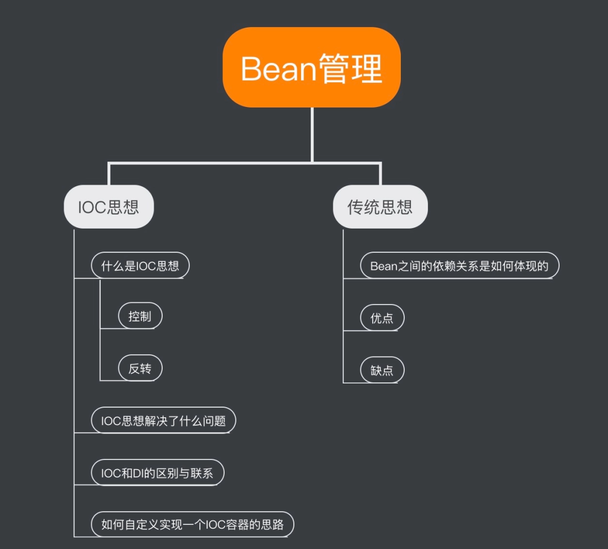
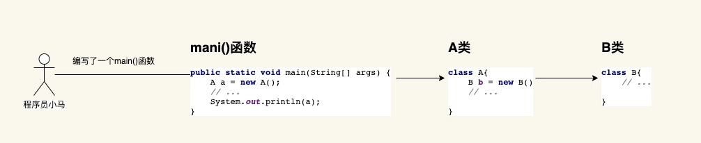
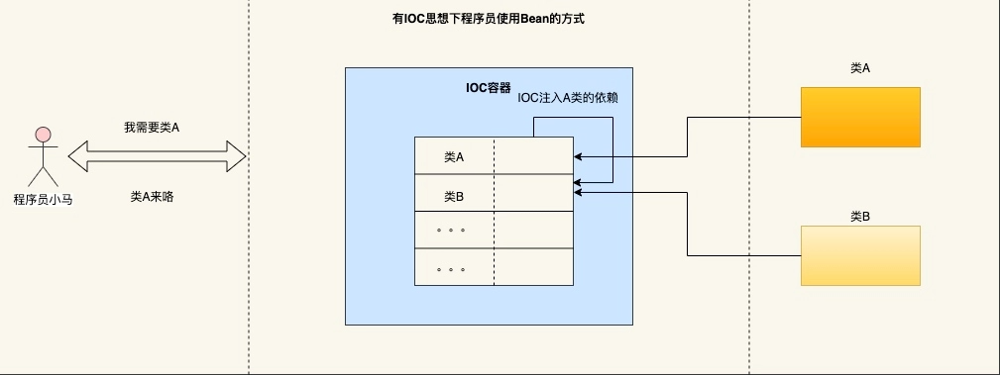
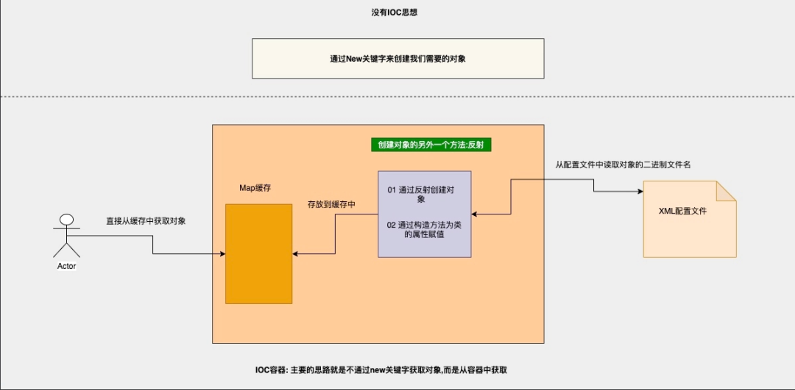

<!-- more -->
<b style="color: orangered">传统的思想(没有IOC容器的情况下)</b>
&nbsp;&nbsp;&nbsp;&nbsp;在没有IOC容器的情况下，如果我们需要某个类的具体操作如下所示：

<b style="color: orangered">传统的Bean创建</b>
&nbsp;&nbsp;&nbsp;&nbsp;1.程序员A进行了主动的使用(new)即创建了A类，A类中又依赖B类然后在对B类进行创建
&nbsp;&nbsp;&nbsp;&nbsp;2.创建对象的权利现在是程序员手上需要哪个类就会对哪个类进行创建
&nbsp;&nbsp;&nbsp;&nbsp;3.B类是由于程序员调用了A类有对B类的依赖随着而创建
&nbsp;&nbsp;&nbsp;&nbsp;4.总之就是自己动手丰衣足食，没有借助任何中间产物
&nbsp;&nbsp;&nbsp;&nbsp;<b style="color: #6A6AFF">优点：</b>
&nbsp;&nbsp;&nbsp;&nbsp;&nbsp;&nbsp;&nbsp;&nbsp;很直接的一个优点就是简单，我们需要什么就去创建什么，在程序员的角度上也是比较直观容易理解的。
&nbsp;&nbsp;&nbsp;&nbsp;<b style="color: #6A6AFF">缺点：</b>
&nbsp;&nbsp;&nbsp;&nbsp;&nbsp;&nbsp;&nbsp;&nbsp;Bean之间的协调关系是由程序内部代码来控制的即通过new关键字与我们的业务代码进行了强耦合。没有对Bean进行管理。对Bean没有进行统一的管理和配置。
<b style="color: orangered">IOC思想</b>
&nbsp;&nbsp;&nbsp;&nbsp;<b style="color: #6A6AFF">什么是IOC(Inversion of controller)</b>
&nbsp;&nbsp;&nbsp;&nbsp;&nbsp;&nbsp;&nbsp;&nbsp;IOC是一种思想，而不是一种技术的实现。主要的描述是在软件开发的领域对象的创建和管理的问题。上述我们了解了传统的开发模式，我们再来看看如果有IOC的思想下程序员是如何使用对象的。

&nbsp;&nbsp;&nbsp;&nbsp;&nbsp;&nbsp;&nbsp;&nbsp;从上图可知：
&nbsp;&nbsp;&nbsp;&nbsp;&nbsp;&nbsp;&nbsp;&nbsp;&nbsp;&nbsp;&nbsp;&nbsp;1.程序员只需要告诉IOC自己需要哪个Bean，就不需要关注该Bean创建的细节以及该Bean的相关依赖。这一切IOC容器已经帮你做好了。
&nbsp;&nbsp;&nbsp;&nbsp;&nbsp;&nbsp;&nbsp;&nbsp;&nbsp;&nbsp;&nbsp;&nbsp;2.凡事有得必有失：这个过程中我们失去了创建Bean的权利。
&nbsp;&nbsp;&nbsp;&nbsp;&nbsp;&nbsp;&nbsp;&nbsp;&nbsp;&nbsp;&nbsp;&nbsp;3.了解了基本的使用后，有人说IOC就是控制反转，讲到这里你还没有讲控制反转？好！别急，接下来就是细讲我们常说的控制反转。
&nbsp;&nbsp;&nbsp;&nbsp;<b style="color: #6A6AFF">控制反转</b>
&nbsp;&nbsp;&nbsp;&nbsp;&nbsp;&nbsp;&nbsp;&nbsp;在理解控制反转之前我们首先要清楚控制是指什么？反转又反转了什么？
&nbsp;&nbsp;&nbsp;&nbsp;&nbsp;&nbsp;&nbsp;&nbsp;&nbsp;&nbsp;&nbsp;&nbsp;1.控制：指的就是我们上述说的我们失去的权利(对象的创建或者说是控制对象的权利)
&nbsp;&nbsp;&nbsp;&nbsp;&nbsp;&nbsp;&nbsp;&nbsp;&nbsp;&nbsp;&nbsp;&nbsp;2.反转：指的是控制权的转变。在没有IOC的容器上我们程序员想创建谁就创建谁的权利。在IOC容器下程序员就只能委屈巴巴的向IOC容器索取对象。创建对象的权利有程序员到IOC容器手里了。
&nbsp;&nbsp;&nbsp;&nbsp;<b style="color: #6A6AFF">IOC解决了什么问题？</b>
- 其实就是解决了对象之间的耦合问题。
- 我们不需要再通过new关键字来创建对象，而是从容器中获取，达到一种松耦合的目的。
- 同时IOC容器也方便管理容器内的所以Bean对象。所谓的Bean的生命周期。
&nbsp;&nbsp;&nbsp;&nbsp;<b style="color: #6A6AFF">IOC和DI的区别</b>
&nbsp;&nbsp;&nbsp;&nbsp;&nbsp;&nbsp;&nbsp;&nbsp;<b style="color: #00FFFF">相同点：</b>
- IOC和DI描述的都是同一件事情(对象的实例化以及维护对象与对象已有的依赖关系)
&nbsp;&nbsp;&nbsp;&nbsp;&nbsp;&nbsp;&nbsp;&nbsp;<b style="color: #00FFFF">不同点：</b>
- 首先IOC是一种思想，而DI是一种具体的技术实现手段。
- IOC是站在对象的角度上对象的实例化以及管理从程序员手里交给了IOC容器
- DI是站在容器的角度上会把对象的依赖的其他对象注入到容器中，上述案例中的A类依赖B类IOC容器不仅仅将A类放到容器中，还需要将其依赖的B类也一并加载到IOC容器中。
<b style="color: orangered">如何自定义实现一个IOC容器</b>
&nbsp;&nbsp;&nbsp;&nbsp;思路大致如下所示：
