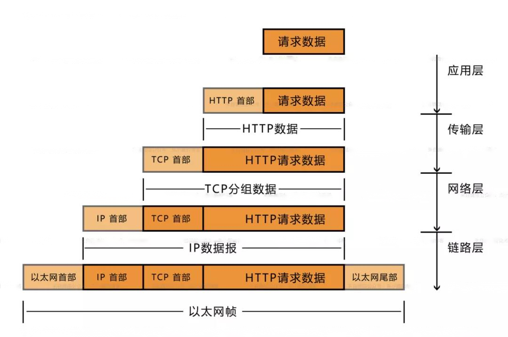
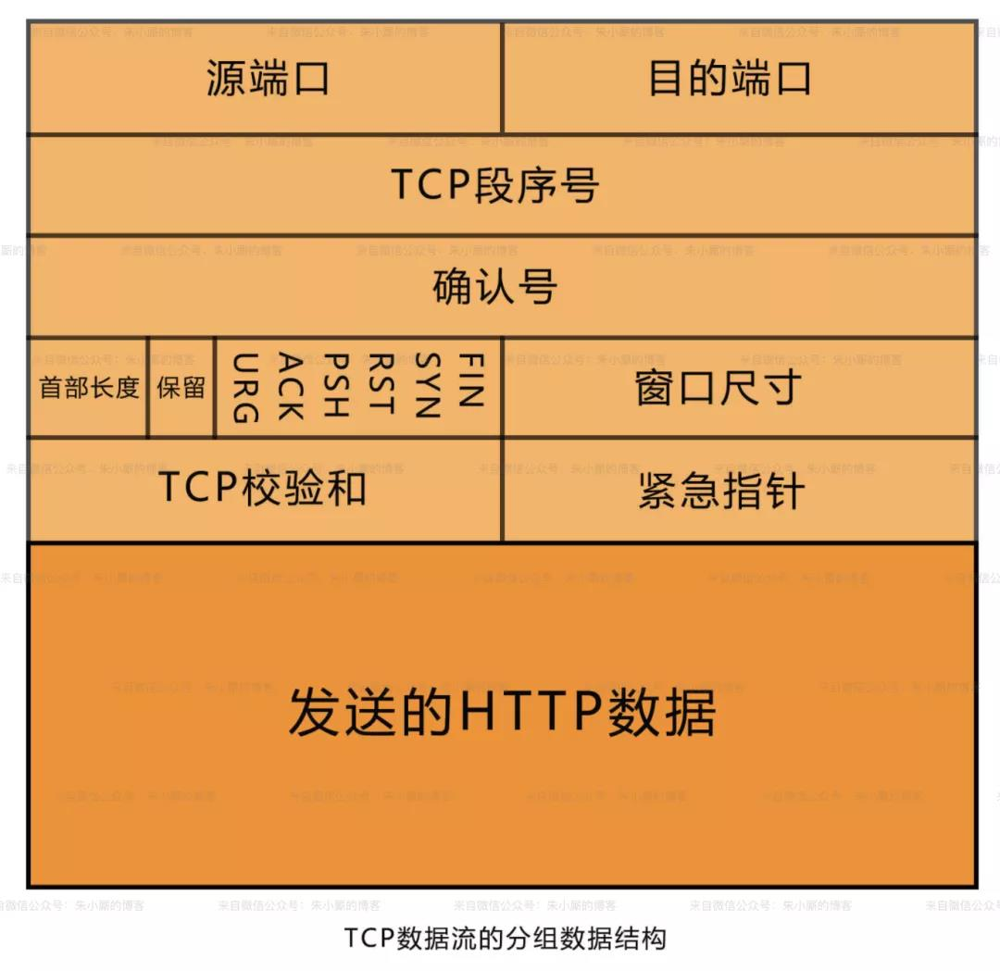
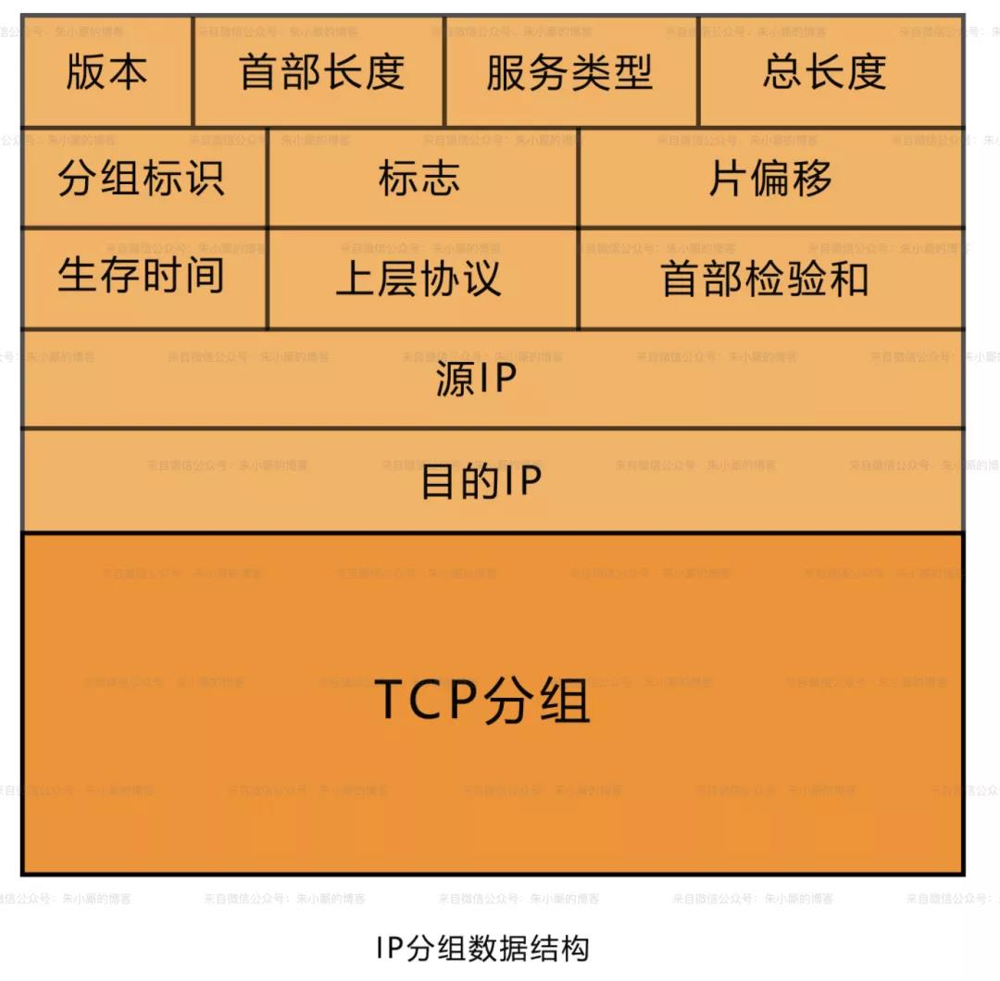

从一个经典的面试题说起，输入URL到页面展现的过程：
&nbsp;&nbsp;&nbsp;&nbsp;1.输入URL后，会先进行域名解析。优先查找本地host文件有无对应的IP地址，没有的话去本地DNS服务器查找，还不行的话，本地DNS服务器会去找根DNS服务器需要一个域服务器的地址进行查询，域服务器将要查询的域名的解析服务器地址返回给本地DNS，本地DNS去这里查询就OK了。
&nbsp;&nbsp;&nbsp;&nbsp;2.浏览器拿到服务器的IP地址后，会向它发送HTTP请求。HTTP请求经由一层层的处理、封装、发出之后，最终经由网络到达服务器，建立TCP/IP连接，服务器接收到请求并开始处理。
&nbsp;&nbsp;&nbsp;&nbsp;3.服务器构建响应，再经由一层层的处理、封装、发出后，到达客户端，浏览器处理请求。
&nbsp;&nbsp;&nbsp;&nbsp;4.浏览器开始渲染页面，解析HTML，构建render树，根据render树的节点和CSS的对应关系，进行布局，绘制画面。
<!-- more -->这4个步骤包含了一个HTTP请求的完整生命周期，文章着重介绍第2步和第3步，也就是请求是如何在两个物理端点之间进行通信的。数据的发出和接收必然会经历一些处理、解析的过程，这些过程在系统的不同层次进行。
<b style="color: orangered">分层</b>
&nbsp;&nbsp;&nbsp;&nbsp;一个HTTP请求从源端发出到终端接收的处理过程都是要经过以下四层。其中每一层都有各自的协议。

|<font color='#0A0A0A'>层级</font>|<font color='#0A0A0A'>协议</font>|
|:-----  |:-----|
|应用层| HTTP|
|传输层| TCP|
|网络层| IP|
|链路层| 设备驱动程序及网卡|
&nbsp;&nbsp;&nbsp;&nbsp;我们先来理解一下协议是什么，协议是经过约定，双方共同承认，并且需要共同遵守的规则。上面的每一层，都有各自的协议，协议的执行者是通信链路两端内的对应层。每一层通过协议来理解数据，并进行处理。
&nbsp;&nbsp;&nbsp;&nbsp;上图中只举例出了最常见的协议，实际上每一层都有细分的协议：
- 应用层：应用程序负责将数据以相应规则(协议)进行包装，发送给传输层
   - <b style="color: #6A6AFF">HTTP:</b>超文本传输协议
   - <b style="color: #6A6AFF">FTP:</b>文件传输协议
   - <b style="color: #6A6AFF">SMTP:</b>简单邮件传送协议
   - <b style="color: #6A6AFF">SNMP:</b>简单网络管理协议
- 传输层：负责将应用层传过来的数据进行分组，为确保终端接收的顺序和完整性，会对每个分组进行标记，交给网络层
   - <b style="color: #6A6AFF">TCP:</b>传输控制协议
   - <b style="color: #6A6AFF">UDP:</b>用户数据协议
- 网络层：负责将传输层发来的数据分组发送到目标终端
   - <b style="color: #6A6AFF">IP:</b>网际协议
   - <b style="color: #6A6AFF">ICMP:</b>Internet互联网控制报文协议
   - <b style="color: #6A6AFF">IGMP:</b>Internet组管理协议
- 链路层：为网络层发送和接收数据单元
   - <b style="color: #6A6AFF">ARP:</b>地址解析协议
   - <b style="color: #6A6AFF">RARP:</b>逆地址解析协议

<b style="color: orangered">封装和分用</b>
&nbsp;&nbsp;&nbsp;&nbsp;数据在经过每一层的时候都要被对应的协议包装，到达终端的时候，要一层一层的解包。这两个过程叫封装和分用。
&nbsp;&nbsp;&nbsp;&nbsp;发送时，用户数据被HTTP封装为报文，每一层会将上一层传过来的报文作为本层的数据块，并添加自己的首部，其中包含了协议标识，这一整体作为本层报文向下传递。
&nbsp;&nbsp;&nbsp;&nbsp;接收时，数据自下而上流动，经过每一层时被去掉报文首部，根据报文标识确定正确的上层协议，最终到应用层被应用程序处理。
&nbsp;&nbsp;&nbsp;&nbsp;<b style="color: #6A6AFF">封装</b>
&nbsp;&nbsp;&nbsp;&nbsp;&nbsp;&nbsp;&nbsp;&nbsp;源端发送HTTP报文时，报文会以数据流的形式通过一条已经打开的TCP连接按序传输，TCP收到数据流后会将其分割成小的数据块，每个小块被添加的TCP首部与数据块共同组成TCP分组，分组经由网络层发送，网络层遵循IP协议，当收到分组发送请求后，会将分组其放入IP数据报，填充报头，将数据报文经由链路层发送出去。

&nbsp;&nbsp;&nbsp;&nbsp;&nbsp;&nbsp;&nbsp;&nbsp;这一过程经过每层的时候都会增加一些首部信息，有时还需要增加尾部信息，每一层都会把数据封装到各自的报文中，并在报文首部添加协议标识，这个过程叫封装。
&nbsp;&nbsp;&nbsp;&nbsp;<b style="color: #6A6AFF">分用</b>
&nbsp;&nbsp;&nbsp;&nbsp;&nbsp;&nbsp;&nbsp;&nbsp;终端接收到一个以太网数据帧时，数据自底而上流动，去掉发送时各层协议加上的报文首部，每层协议都要检查报文首部的协议标识，从而确定上层协议，保证数据被正确处理，这个过程叫分用。

&nbsp;&nbsp;&nbsp;&nbsp;&nbsp;&nbsp;&nbsp;&nbsp;终端从链路层接收到数据请求后，进入网络层对数据进行解析，交给传输层，校验分组顺序和完整性，从数据块中取出数据，得到HTTP报文，交给应用层进行处理。这个过程会逐层剥离报头还原数据。
<b style="color: orangered">逐层分析</b>
&nbsp;&nbsp;&nbsp;&nbsp;我们已经知道，数据是从源端自上而下到终端自下而上被一层层处理的，现在就来看一下每层都做了什么事情。
&nbsp;&nbsp;&nbsp;&nbsp;<b style="color: #6A6AFF">HTTP</b>
&nbsp;&nbsp;&nbsp;&nbsp;&nbsp;&nbsp;&nbsp;&nbsp;HTTP属于应用层，用户触发交互所产生的行为数据和服务端对此的响应都由它封装成HTTP报文，再交由下层协议进行处理。报文的作用是客户端和服务端沟通的载体，双方都要遵循统一规则对信息进行处理，这一规则成为HTTP。
&nbsp;&nbsp;&nbsp;&nbsp;&nbsp;&nbsp;&nbsp;&nbsp;客户端与服务端的交互往往非常复杂，为了使双方都能高效、明确、安全的通信(例如传递意图与状态、承载数据、携带认证信息、控制连接行为与缓存)，需要依赖报文中的结构来实现，下面先从结构开始看。
&nbsp;&nbsp;&nbsp;&nbsp;<b style="color: #6A6AFF">报文结构</b>
&nbsp;&nbsp;&nbsp;&nbsp;&nbsp;&nbsp;&nbsp;&nbsp;HTTP报文的结构分为请求和响应两种，请求报文封装用户操作产生的动作，告知服务器应采取什么行为，响应报文来告知客户端请求的结果。
&nbsp;&nbsp;&nbsp;&nbsp;&nbsp;&nbsp;&nbsp;&nbsp;请求报文格式：
```
<method> <request-url> <version> // 起始行格式
<headers> // 首部
<body> // 实体
```
&nbsp;&nbsp;&nbsp;&nbsp;&nbsp;&nbsp;&nbsp;&nbsp;响应报文格式：
```
<method> <status> <reason-phrase> // 起始行格式
<headers> // 首部
<body> //实体
```
&nbsp;&nbsp;&nbsp;&nbsp;<b style="color: #6A6AFF">起始行</b>
&nbsp;&nbsp;&nbsp;&nbsp;&nbsp;&nbsp;&nbsp;&nbsp;报文的起始行表明了报文的开始，请求和响应各自的起始行的格式也不相同。
&nbsp;&nbsp;&nbsp;&nbsp;&nbsp;&nbsp;&nbsp;&nbsp;请求报文的起始行说明要做什么，结构为方法+请求URL+协议版本，中间用空格作分隔：
```
GET /api/nht/blog/example HTTP/1.1
```
&nbsp;&nbsp;&nbsp;&nbsp;&nbsp;&nbsp;&nbsp;&nbsp;响应报头的起始行说明发生了什么，结构为协议版本+状态码+描述文本，中间用空格作分隔：
```
HTTP/1.1 200 OK
```
&nbsp;&nbsp;&nbsp;&nbsp;<b style="color: #6A6AFF">方法和状态码</b>
&nbsp;&nbsp;&nbsp;&nbsp;&nbsp;&nbsp;&nbsp;&nbsp;方法来告诉服务端请求报文需要做的事情，状态码来通知客户端：服务端请求报文完成动作之后的大致结果。常见的HTTP方法如下：

|<font color='#0A0A0A'>方法</font>|<font color='#0A0A0A'>含义</font>|<font color='#0A0A0A'>有无主体</font>|
|:-----  |:-----|:-----|
| GET | 从服务端获取资源 | 无 |
| HEAD | 只获取资源头部 | 无 |
| POST | 向服务端发送数据 | 有 |
| PUT | 将客户端发送的数据存到服务端，应用场景多为修改 | 有 |
| OPTIONS | 对服务端进行预检，例如服务端支持哪些方法 | 无 |
| DELETE | 从服务端删除资源 | 无 |
&nbsp;&nbsp;&nbsp;&nbsp;&nbsp;&nbsp;&nbsp;&nbsp;请求完成时，响应报文中会有一个状态码，用来表示此次请求的状态，是成功了还是失败了，或者是需要重定向。状态码的范围从100到599，其中有部分已经定义的。不同的范围表示的含义也不同：

|<font color='#0A0A0A'>范围</font>|<font color='#0A0A0A'>已定义范围</font>|<font color='#0A0A0A'>含义</font>|
|:-----  |:-----|:-----|
| 100~199 | 100~101 | 信息提示 |
| 200~299 | 200~206 | 成功 |
| 300~399 | 300~305 | 重定向 |
| 400~499 | 400~415 | 客户端错误 |
| 500~599 | 500~505 | 服务端错误 |
&nbsp;&nbsp;&nbsp;&nbsp;<b style="color: #6A6AFF">首部</b>
&nbsp;&nbsp;&nbsp;&nbsp;&nbsp;&nbsp;&nbsp;&nbsp;首部是请求和响应报文中的一些信息，形式为键值对，每对键值结尾是CRLF换行符，它决定了请求或者响应报文的属性，比如Content-Type表明了请求主体的数据类型，Date说明了请求的创建时间。客户端与服务端通过首部来协商具体行为。可以根据请求、响应、结构等，将首部分为五种。
- 请求首部：是放在请求报文中的首部，它被用来告诉服务端一些信息。
- 响应首部：为客户端提供一些可能用到的信息。
- 通用首部：请求和响应报文都包含的首部，例如Date首部。
- 实体首部：对于报文实体主体部分的描述，比如Content-Type,表明其数据类型。
- 扩展首部：开发者自己添加的首部字段，用来满足定制化需求。
&nbsp;&nbsp;&nbsp;&nbsp;<b style="color: #6A6AFF">实体</b>
```
HTTP/1.1 200 OK
Server: XXXXX
Date: Sun,17 Sep 2019 02:01:16 GMT
--------------------------------实体首部
Content-Type: text/plain
Content-length: 18
--------------------------------实体主体
Hi! i'm a message!
--------------------------------
```
&nbsp;&nbsp;&nbsp;&nbsp;&nbsp;&nbsp;&nbsp;&nbsp;实体部分是可选的，它被用来运送请求或者响应的数据，实体由实体首部+实体主体组成，实体首部对实体主体做描述。HTTP/1.1定义了以下的基本实体首部字段：
- Content-Type: 实体主体中的数据类型。
- Content-Length: 实体主体的长度或者大小。
- Content-Language: 和传输的数据最匹配的语言。
- Content-Encoding: 来标识服务端编码时所用的编码方式。
- Content-Location: 要返回的数据的地址。
- Content-Range: 如果是部分实体，用来标记它是实体的哪个部分。
- Content-MD5: 实体主体内容的校验和。
- Last-Modified: 所传输内容在服务器上创建或者最后修改的日期时间。
- Expires: 实体数据下的日期时间。
- Allow: 所请求资源允许的请求方法。
- ETag: 资源的特定版本的标识符，可以让缓存更高效，并节省带宽。
- Cache-Control: 控制缓存机制的指令。
&nbsp;&nbsp;&nbsp;&nbsp;&nbsp;&nbsp;&nbsp;&nbsp;以上是HTTP报文包含的主要结构，当请求报文到达服务器时，服务器会对报文中的内容解析出来，根据方法、资源路径、首部和主体来处理请求，然后通过请求资源的访问结果，来构建响应，回送给客户端。
<b style="color: orangered">传输层-TCP</b>
&nbsp;&nbsp;&nbsp;&nbsp;HTTP连接是建立在TCP连接的基础之上的，TCP提供可靠的数据连接。当要传输一个HTTP报文时，报文数据会以流的形式通过一条已经打开的TCP连接按顺序传输，TCP会将收到的数据分成小块，每块是一个TCP分组。
&nbsp;&nbsp;&nbsp;&nbsp;由于数据是分成小块发送的，所以完整可靠的数据传输主要体现在：分组是否完整、分组顺序是否正常、分组是否损坏、分组数据是否重复。这些可以通过TCP的校验和、序列号、确认应答、重发控制、连接管理和窗口机制来控制。
&nbsp;&nbsp;&nbsp;&nbsp;TCP是传输控制协议，传输控制主要依赖首部包含的6个标志，他们控制报文的传输状态以及发送端和接收端应对数据采取的动作、当它们的值为1时，标志对应的各自功能才允许被执行，比如当URG为1时，报文首部的紧急指针部分才有效。
- URG：紧急指针
- ACK：确认序号有效
- PSH：接收方应该尽快将这个报文段交给应用层
- RST：重建连接
- SYN：同步序号用来发起一个连接
- FIN：发送端完成发送任务

&nbsp;&nbsp;&nbsp;&nbsp;&nbsp;&nbsp;&nbsp;&nbsp;<b style="color: #00FFFF">源端口和目的端口：</b>标识发送发和接收方的端口号，一个TCP连接通过4个值确认：源IP、源端口、目的IP、目的端口，其中源IP和目的IP包含在IP分组内。
&nbsp;&nbsp;&nbsp;&nbsp;&nbsp;&nbsp;&nbsp;&nbsp;<b style="color: #00FFFF">首部长度：</b>表示TCP首部的字节长度，也能标记出从多少个字节开始，才是需要传输的数据。
&nbsp;&nbsp;&nbsp;&nbsp;&nbsp;&nbsp;&nbsp;&nbsp;<b style="color: #00FFFF">TCP段序号：</b>本段报文发送的数据第一个字节的序号，每段报文中的数据的每个字节都有序号，每一个字节的序号从0开始，依次加1，加到(2^32)-1再次从0开始。
&nbsp;&nbsp;&nbsp;&nbsp;&nbsp;&nbsp;&nbsp;&nbsp;<b style="color: #00FFFF">TCP段确认序号：</b>当首部标志ACK为1时，确认序号有效。TCP段被接收端接收后，会回送给发送端一个确认号，为上次接收的最后一个字节序号+1。
&nbsp;&nbsp;&nbsp;&nbsp;&nbsp;&nbsp;&nbsp;&nbsp;<b style="color: #00FFFF">校验和：</b>由发送端计算，接收端验证，如果接收方检测到校验和不正确，表明该TCP段可能有损坏，会被丢弃，同时接收端向回送一个重复的确认号(与最近的一次正确的报文传输的确认号重复)，表明接收到的TCP段是错误的，并告知自己希望收到的序号。这时发送端需要立即重传出错的TCP段。
&nbsp;&nbsp;&nbsp;&nbsp;&nbsp;&nbsp;&nbsp;&nbsp;<b style="color: #00FFFF">紧急指针：</b>当首部标志URG为1时，紧急指针有效，表示发送端向接收端要发送紧急数据。紧急指针是一个正偏移量，它和TCP段序号相加，计算出紧急数据的最后一个字节的序号。比如接收方接收到数据，从序号为1000的字节开始读取，紧急指针为1000，那么紧急数据就是序号从1000到2000之间的字节。这些数据有接收方决定如何处理。
&nbsp;&nbsp;&nbsp;&nbsp;&nbsp;&nbsp;&nbsp;&nbsp;<b style="color: #00FFFF">窗口尺寸：</b>决定了一个TCP一次成块数据流的吞吐量。需要注意的是，它表示的是发送一方的允许对方发送的数据量，比如发送方首部中的窗口大小为1000，就表示发送发最多可以接受对方发送的1000个字节的数据量。这与发送方的数据缓存空间有关，会影响TCP的性能。
&nbsp;&nbsp;&nbsp;&nbsp;&nbsp;&nbsp;&nbsp;&nbsp;<b style="color: #00FFFF">首部标志PSH：</b>如果需要告诉接收方将数据立即全部提交给接收进程，发送发需要将PSH置为1，这里的数据是和PSH一起传送的数据以及之前接收到的全部数据，如果接收方收到了PSH为1的标志，需要立即将数据提交给接收进程，不同再等待有没有其他数据进来。
&nbsp;&nbsp;&nbsp;&nbsp;&nbsp;&nbsp;&nbsp;&nbsp;<b style="color: #00FFFF">复位标志RST：</b>当RST为1时，表示连接出现了异常情况，接收方将终止连接，通知应用层重新建立连接。
&nbsp;&nbsp;&nbsp;&nbsp;&nbsp;&nbsp;&nbsp;&nbsp;<b style="color: #00FFFF">同步序号SYN：</b>用来建立连接，涉及到TCP的三次握手。
&nbsp;&nbsp;&nbsp;&nbsp;&nbsp;&nbsp;&nbsp;&nbsp;&nbsp;&nbsp;&nbsp;&nbsp;1.开始建立连接时，客户端想服务器发送一个TCP分组，分组首部的SYN为1，并携带一个初始序号，表明这是一个连接请求。
&nbsp;&nbsp;&nbsp;&nbsp;&nbsp;&nbsp;&nbsp;&nbsp;&nbsp;&nbsp;&nbsp;&nbsp;2.如果服务器接受了连接，会向客户端发送一个TCP分组，分组中会包含SYN和ACK都为1，同时包含一个确认序号，值为来自客户端的初始序号+1，表示连接已经被接受。
&nbsp;&nbsp;&nbsp;&nbsp;&nbsp;&nbsp;&nbsp;&nbsp;&nbsp;&nbsp;&nbsp;&nbsp;3.客户端收到上一步发来的分组后，会再向服务器发来一段确认报文分组，ACK为1，会再次携带确认序号，值是第二步来自客户端的确认序号+1。服务端收到确认消息后，进入已经连接的状态。
&nbsp;&nbsp;&nbsp;&nbsp;&nbsp;&nbsp;&nbsp;&nbsp;&nbsp;&nbsp;&nbsp;&nbsp;在第3步的确认分组中，是可以携带要发送的数据的。
&nbsp;&nbsp;&nbsp;&nbsp;&nbsp;&nbsp;&nbsp;&nbsp;<b style="color: #00FFFF">连接终止标志FIN：</b>用来关闭连接，当一端完成数据发送任务后会发送一个FIN标志来终止连接，但因为TCP在两个方向(C-S,S-C)上会有数据传递，每个方向有各自的发送FIN&确认关闭流程，所以会有四次交互，也称为4次挥手。
&nbsp;&nbsp;&nbsp;&nbsp;&nbsp;&nbsp;&nbsp;&nbsp;&nbsp;&nbsp;&nbsp;&nbsp;1.如果客户端应用层的数据发送完毕，会导致客户端的TCP报文发送一个FIN，告知服务器准备关闭数据传送。
&nbsp;&nbsp;&nbsp;&nbsp;&nbsp;&nbsp;&nbsp;&nbsp;&nbsp;&nbsp;&nbsp;&nbsp;2.服务器接收到这个标志后，它发回一个ACK，确认序号为收到的序号+1，同时TCP还要向应用程序发一个文件结束符。
&nbsp;&nbsp;&nbsp;&nbsp;&nbsp;&nbsp;&nbsp;&nbsp;&nbsp;&nbsp;&nbsp;&nbsp;3.此时服务器关闭这个方向的连接，导致它的TCP也会发送一个FIN。
&nbsp;&nbsp;&nbsp;&nbsp;&nbsp;&nbsp;&nbsp;&nbsp;&nbsp;&nbsp;&nbsp;&nbsp;4.客户端接收到之后发回一个确认ACK，序号为收到的序号+1，连接完全关闭。
&nbsp;&nbsp;&nbsp;&nbsp;&nbsp;&nbsp;&nbsp;&nbsp;TCP段序号与确认序号保证了数据的顺序，校验和确保了数据的完整性，紧急指针保证紧急数据可被及时处理。另外，TCP还有一些超时重传、拥塞避免、慢启动的机制，都可以保证分组数据按照顺序完整的传到目标端。
<b style="color: orangered">网络层-IP</b>
&nbsp;&nbsp;&nbsp;&nbsp;如果说TCP分组是包装货物的集装箱，那么IP就是运送集装箱的卡车。IP协议提供了两个节点之间的连接，保证将TCP数据尽可能快的从源端送到终端，但却不能保证传输的可靠性。
&nbsp;&nbsp;&nbsp;&nbsp;IP层会将上层传过来的TCP分组封装，带上自己的首部，再进行选路、是否分片以及重组的工作，最终到达目的地，这个过程中，IP首部起了重要的作用，下面让我们看一下首部的结构。
&nbsp;&nbsp;&nbsp;&nbsp;<b style="color: #6A6AFF">IP首部</b>

&nbsp;&nbsp;&nbsp;&nbsp;&nbsp;&nbsp;&nbsp;&nbsp;<b style="color: #00FFFF">版本：</b>表示当前IP协议的版本，目前版本号是4，还有一种是6，也就是IPV4和IPV6，如果发送和接收这两端的版本协议不一致，那么当前IP数据报会被丢弃。
&nbsp;&nbsp;&nbsp;&nbsp;&nbsp;&nbsp;&nbsp;&nbsp;<b style="color: #00FFFF">首部长度：</b>整个首部的长度，最长为60字节。
&nbsp;&nbsp;&nbsp;&nbsp;&nbsp;&nbsp;&nbsp;&nbsp;<b style="color: #00FFFF">服务类型(TOS)：</b>用来区分服务的类型，但其实IP在工作的时候一直没有实际使用过，现有的TOS只有4bit的子字段和1bit的未用位。未用位必须置为0。TOS的4个bit中只能将1个置成1，用来表示当前服务类型。4bit对应的4个服务类型分别是：最小时延、最大吞吐量、最高可靠性和最小费用。
&nbsp;&nbsp;&nbsp;&nbsp;&nbsp;&nbsp;&nbsp;&nbsp;<b style="color: #00FFFF">总长度：</b>表示当前的数据报文的总长度，单位为字节，可以结合首部长度计算出报文内数据的大小以及起始位置。
&nbsp;&nbsp;&nbsp;&nbsp;&nbsp;&nbsp;&nbsp;&nbsp;下面这三个首部字段涉及到IP数据的分片和重组过程，由于网络层一般会限制每个数据帧的最大长度，IP层发送数据报会在选路的同时查询当前设备网络层的每个数据帧的最大传输长度，一旦超出，数据报就会呗进行分片，到达目的地之后再进行重组，此时就会用到以下三个字段作为重组依据。需要注意的是：因为存在选路的过程，数据报经过的每层路由设备对于数据帧的最大传输长度都不同，所以分片可能发生在任意一次选路的过程中。
&nbsp;&nbsp;&nbsp;&nbsp;&nbsp;&nbsp;&nbsp;&nbsp;<b style="color: #00FFFF">分组标识：</b>这个标识相当于ID,每成功发送一个分片，IP层就会把这个分组ID加1。
&nbsp;&nbsp;&nbsp;&nbsp;&nbsp;&nbsp;&nbsp;&nbsp;<b style="color: #00FFFF">标志：</b>共占用三位，分别是R、D、M，R目前还没有被使用，有用的是D和M。这个字段表示了数据报的分片行为。D如果为1的话，表示数据无需分片，一次传输完；M如果为1，表示数据是分片的，后面还有数据，当它为0时，就表示当前数据报是最后一个分片，或者只有这一个分片。
&nbsp;&nbsp;&nbsp;&nbsp;&nbsp;&nbsp;&nbsp;&nbsp;<b style="color: #00FFFF">偏移量：</b>标识了当前分片距离原始数据报开始处的位置，分片之后，每一片的总长度会改成这一片的长度值，而不是整个数据报的长度。
&nbsp;&nbsp;&nbsp;&nbsp;&nbsp;&nbsp;&nbsp;&nbsp;<b style="color: #00FFFF">生存时间(TTL)：</b>可以决定数据报是否被丢弃。因为IP发送数据是逐条的，数据有可能在被设置了路由功能的不同的IP层之间转发，所以生存时间表示了数据报最多可以经过多少个处理过它的路由，每经过一层路由，值减去1，当值为0时数据报就被丢弃，并且发送一个带有错误的报文(ICMP,IP层的组成部分，被用来传递一些错误信息)给源端。生存时间可以有效解决数据报在一个路由环路中一直转发的问题。
&nbsp;&nbsp;&nbsp;&nbsp;&nbsp;&nbsp;&nbsp;&nbsp;<b style="color: #00FFFF">首部校验和：</b>校验数据报的完整性，发送端对首部进行求和，将结果存在检验和中，接收端再计算一遍，如果计算结果与存在检验和中的结果一致，则说明传输过程是OK的，否则这个数据报就会被丢弃。
&nbsp;&nbsp;&nbsp;&nbsp;&nbsp;&nbsp;&nbsp;&nbsp;<b style="color: #00FFFF">上层协议：</b>决定了接收端在分用的时候将数据交给哪个上层协议去处理，例如TCP或者UDP。
&nbsp;&nbsp;&nbsp;&nbsp;&nbsp;&nbsp;&nbsp;&nbsp;<b style="color: #00FFFF">源IP：</b>记录了发送端的IP，在回送错误信息时用到。
&nbsp;&nbsp;&nbsp;&nbsp;&nbsp;&nbsp;&nbsp;&nbsp;<b style="color: #00FFFF">目的IP：</b>表示目的IP，每一次选路都要以它来做决策。
&nbsp;&nbsp;&nbsp;&nbsp;<b style="color: #6A6AFF">路由选择</b>
&nbsp;&nbsp;&nbsp;&nbsp;&nbsp;&nbsp;&nbsp;&nbsp;因为IP首部只包含了目的IP地址，并不体现完整的路径，当向外发送数据时，IP层会根据目的IP在本机路由表中的查询结果来做出选路决策，数据报会逐跳地被运送到目的地，这里的每一跳就是一次路由的选择。
&nbsp;&nbsp;&nbsp;&nbsp;&nbsp;&nbsp;&nbsp;&nbsp;IP层既可配置成路由器，也可以配置成主机。当配置成路由功能时，可以对数据报进行转发，配置成主机时，如果目的IP不是本机IP，数据报会被丢弃。
&nbsp;&nbsp;&nbsp;&nbsp;&nbsp;&nbsp;&nbsp;&nbsp;具有路由功能的IP层在当目标IP不是本机地址的时候是根据什么判断转发到哪一站呢？要理解这个问题，需要先明白路由表的结构，以下是IP层维护的路由表，(windows系统可以在控制台输入netstat -r查看路由表)

|<font color='#0A0A0A'>Destination</font>|<font color='#0A0A0A'>Gateway</font>|<font color='#0A0A0A'>Flags</font>|<font color='#0A0A0A'>Refcnt</font>|<font color='#0A0A0A'>Use</font>|<font color='#0A0A0A'>Interface</font>|
|:-----  |:-----|:-----|:-----  |:-----|:-----|
| 140.252.13.65 | 140.252.13.35 | UGH | 0 | 0 | emd0 |
| 127.0.0.1 | 127.0.0.1 | UH | 1 | 0 | lo0 |
| default | 140.252.13.33 | UG | 0 | 0 | emd0 |
| 140.252.13.32 | 140.252.13.34 | U | 4 | 25043 | emd0 |
- Destination(目的IP):表示IP数据报最终要到达或者经过的网络地址或者主机地址。
- Gateway(下一跳地址):当前维护路由表设备的相邻路由器的地址。
- Flags(标志):表示当前这一条路由记录的属性，具体用五个不同的标志来表示：
   - U:该路由可以使用
   - G:如果有这个标志，表示是下一跳是一个网关，如果没有，表示下一跳是和当前设备在一个网段，也就是可以直接把数据报发过去
   - H:下一跳是一个主机还是一个网络，有这个标志，表示主机；没有，则表示下一跳的路由是一个网络
   - D:该路由是由重定向报文创建的
   - M:该路由已被重定向报文修改
&nbsp;&nbsp;&nbsp;&nbsp;&nbsp;&nbsp;&nbsp;&nbsp;每收到一个数据报时候，IP层就会根据目的IP在路由表里查询，根据查询状态会导向三种结果：
&nbsp;&nbsp;&nbsp;&nbsp;&nbsp;&nbsp;&nbsp;&nbsp;&nbsp;&nbsp;&nbsp;&nbsp;1.找到了与目的IP完全匹配的路由项，将报文发给该路由项的下一站路由(Gateway)或者网络接口(Interface)
&nbsp;&nbsp;&nbsp;&nbsp;&nbsp;&nbsp;&nbsp;&nbsp;&nbsp;&nbsp;&nbsp;&nbsp;2.找到了与目的IP的网络号匹配的路由项，将报文发送该路由项的下一站路由(Gateway)或者网络接口(Interface)
&nbsp;&nbsp;&nbsp;&nbsp;&nbsp;&nbsp;&nbsp;&nbsp;&nbsp;&nbsp;&nbsp;&nbsp;3.前两者都没有找到，就看路由表里面有没有默认路由项(default)，有的话发给它指定的下一站路由(Gateway)
&nbsp;&nbsp;&nbsp;&nbsp;&nbsp;&nbsp;&nbsp;&nbsp;要是上面三个都没有结果，那么数据报就不能被发送。IP数据报就是这样一跳一跳地被送往目的主机的，但数据报有固有的长度，一旦超出目的主机的MTU，那会被分片。
&nbsp;&nbsp;&nbsp;&nbsp;<b style="color: #6A6AFF">数据报分片的概念</b>
&nbsp;&nbsp;&nbsp;&nbsp;&nbsp;&nbsp;&nbsp;&nbsp;TCP在进行握手的时候，会根据目的端IP层的最大传输单元(MTU)来决定TCP数据每次能传输的最大数据量(MSS)，之后TCP会对数据依照MSS来进行分组，每个分组会被包装进一个IP数据报内。当IP数据报经过选路过程中的任意一层路由时，有可能被MTU限制住从而被分片，这时IP首部的3bit标志中的M标志被置为1，表示需要分片。每个分片的首部基本一样，只是片偏移有所不同。根据片偏移，这些分片在目的端呗重组成一个完整的IP数据报(一个TCP分组)。IP传输是无序的，所以得到的数据报也是无序的，但如果数据完整，TCP会根据首部中的字段对其进行排序。一旦IP分片丢失，IP层无法组成完整的数据报，就会告诉TCP层，TCP进行重传。
&nbsp;&nbsp;&nbsp;&nbsp;&nbsp;&nbsp;&nbsp;&nbsp;当IP层将数据封装好之后，只有目标主机的IP地址。光有IP地址并不能直接把数据报发送过去，因为每一台硬件设备都有自己的MAC地址，是一个48bit的值。现在知道目标IP的地址，需要找到这个IP对应的MAC地址。这个过程要通过查询路由表，再结合链路层的ARP协议，最终获得目标IP对应的MAC地址。
<b style="color: orangered">地址解析协议：ARP</b>
&nbsp;&nbsp;&nbsp;&nbsp;IP只能让数据在逻辑端点之间流动，但是IP之下还有网络接口层，这一层也有自己的地址(MAC地址：用于在网络中唯一标识一个网卡)，从IP地址到MAC地址需要一个转换的过程，ARP就是提供这一服务的。
&nbsp;&nbsp;&nbsp;&nbsp;ARP协议实现了从IP地址到MAC地址的映射。一开始，起点并不知道目标的MAC地址，只有目标IP，要获取这个地址就涉及到了ARP的请求和应答。同样，ARP也有自己的分组，先看一下分组格式。
&nbsp;&nbsp;&nbsp;&nbsp;<b style="color: #6A6AFF">ARP分组格式</b>

&nbsp;&nbsp;&nbsp;&nbsp;&nbsp;&nbsp;&nbsp;&nbsp;<b style="color: #00FFFF">以太网目的地址：</b>目的端的MAC地址，当ARP缓存表中没有的时候，这里为广播地址。
&nbsp;&nbsp;&nbsp;&nbsp;&nbsp;&nbsp;&nbsp;&nbsp;<b style="color: #00FFFF">以太网源地址：</b>发送端的MAC地址。
&nbsp;&nbsp;&nbsp;&nbsp;&nbsp;&nbsp;&nbsp;&nbsp;<b style="color: #00FFFF">帧类型：</b>不同的帧类型有不同的格式和MTU值，不同的类型有不同的编号，这里ARP对应的编号是0x0806。
&nbsp;&nbsp;&nbsp;&nbsp;&nbsp;&nbsp;&nbsp;&nbsp;<b style="color: #00FFFF">硬件类型：</b>指链路层网络类型，1为以太网。
&nbsp;&nbsp;&nbsp;&nbsp;&nbsp;&nbsp;&nbsp;&nbsp;<b style="color: #00FFFF">协议类型：</b>指的是要转换的地址类型，0x0800为IP地址。比如将以太网地址转换为IP地址。
&nbsp;&nbsp;&nbsp;&nbsp;&nbsp;&nbsp;&nbsp;&nbsp;<b style="color: #00FFFF">op(操作类型)：</b>有四种，分别是ARP请求(1)，ARP应答(2)，RARP请求(3)，RARP应答(4)。
&nbsp;&nbsp;&nbsp;&nbsp;&nbsp;&nbsp;&nbsp;&nbsp;<b style="color: #00FFFF">源MAC地址：</b>表示发送端MAC地址。
&nbsp;&nbsp;&nbsp;&nbsp;&nbsp;&nbsp;&nbsp;&nbsp;<b style="color: #00FFFF">源IP地址：</b>表示发送端IP地址。
&nbsp;&nbsp;&nbsp;&nbsp;&nbsp;&nbsp;&nbsp;&nbsp;<b style="color: #00FFFF">目标以太网地址：</b>表示目标设备的MAC物理地址。
&nbsp;&nbsp;&nbsp;&nbsp;&nbsp;&nbsp;&nbsp;&nbsp;<b style="color: #00FFFF">目标IP地址：</b>表示目标设备的IP地址。
&nbsp;&nbsp;&nbsp;&nbsp;当两台设备发送报文之前，源端的链路层会用ARP协议去询问目的端的MAC地址，ARP会将一个请求广播出去，以太网上的每一个主机都会收到这份广播，广播的目的是询问目标IP的MAC地址，内容主要是先介绍自己的IP和MAC地址，再询问如果你有目标IP，请回复你的硬件地址。如果一个主机收到广播后看到自己有这个IP，并且请求内有源IP和MAC地址，那么就会向源主机回应一个ARP应答。如果没有目标IP，就会丢弃这个请求。可以看出请求是向外广播的，而应答是单独回应的。
&nbsp;&nbsp;&nbsp;&nbsp;但不能每次通信之前都去经历一次请求-应答过程，在成功地接收到应答之后，IP和MAC地址的映射关系就会缓存在ARP缓存表中，有效期一般为20分钟，便于网络层下次直接进行封装，所以，完整的过程应该是：
&nbsp;&nbsp;&nbsp;&nbsp;&nbsp;&nbsp;&nbsp;&nbsp;IP层接收到TCP分组之后，发送或者封装之前，通过查询路由表：
&nbsp;&nbsp;&nbsp;&nbsp;&nbsp;&nbsp;&nbsp;&nbsp;&nbsp;&nbsp;&nbsp;&nbsp;1.当目标IP和自己在同一个网段时，先去ARP缓存表里找有没有目标IP对应的MAC地址，有的话交给链路层进行封装发送出去。如果缓存表内没有，进行广播，获得MAC地址后缓存起来，IP层再对TCP进行封装，然后交给链路层再封装发送出去。
&nbsp;&nbsp;&nbsp;&nbsp;&nbsp;&nbsp;&nbsp;&nbsp;&nbsp;&nbsp;&nbsp;&nbsp;2.当目标IP和自己不在同一个网段，需要将报文发给默认的网关。如果ARP缓存表中有网关IP对应的MAC地址，那么交给链路层进行封装发送出去。如果没有，进行广播，获得地址后缓存起来，IP层再对TCP进行封装，然后交给链路层再封装发送出去。
<b style="color: orangered">以太网数据帧</b>
&nbsp;&nbsp;&nbsp;&nbsp;上面所有东西都准备好了，封装发送的其实是以太网数据帧。以太网的地址、以太网源地址、帧类型这三者组成了帧首部。在首部之前还会插入前同步码和帧开始定界符告知接收端做一些准备工作。桢检测序列FCS被添加进尾部，用来检测帧是否出错。
&nbsp;&nbsp;&nbsp;&nbsp;<b style="color: #6A6AFF">结构</b>

&nbsp;&nbsp;&nbsp;&nbsp;&nbsp;&nbsp;&nbsp;&nbsp;<b style="color: #00FFFF">前同步码：</b>协调终端接收适配器的时钟频率，让它与发送端频率相同。
&nbsp;&nbsp;&nbsp;&nbsp;&nbsp;&nbsp;&nbsp;&nbsp;<b style="color: #00FFFF">帧开始定界符：</b>帧开始的标志，表示帧信息要来了，准备接受。
&nbsp;&nbsp;&nbsp;&nbsp;&nbsp;&nbsp;&nbsp;&nbsp;<b style="color: #00FFFF">目的地址：</b>接收帧的网络适配器的MAC地址，接收端收到帧时，会首先检查目的地址与本机地址是否相符，不是的话就会丢弃。
&nbsp;&nbsp;&nbsp;&nbsp;&nbsp;&nbsp;&nbsp;&nbsp;<b style="color: #00FFFF">源地址：</b>发送端设备的MAC地址。
&nbsp;&nbsp;&nbsp;&nbsp;&nbsp;&nbsp;&nbsp;&nbsp;<b style="color: #00FFFF">类型：</b>决定接收到帧之后将数据交由哪种协议处理。
&nbsp;&nbsp;&nbsp;&nbsp;&nbsp;&nbsp;&nbsp;&nbsp;<b style="color: #00FFFF">数据：</b>交给上层的数据。在本文的场景中指IP数据报。
&nbsp;&nbsp;&nbsp;&nbsp;&nbsp;&nbsp;&nbsp;&nbsp;<b style="color: #00FFFF">桢检验序列：</b>检测这一帧是否出错，发送方计算帧的循环冗余码校验(CRC)值，把这个值写到帧里。接收方计算机重新计算CRC，与FCS字段的值进行比较。如果两个值不相同，则表示传输过程中发生了数据丢失或改变。这时，就需要重新传输这一帧。
&nbsp;&nbsp;&nbsp;&nbsp;<b style="color: #6A6AFF">传输和接收</b>
&nbsp;&nbsp;&nbsp;&nbsp;&nbsp;&nbsp;&nbsp;&nbsp;1.接收到上层传过来的数据报之后，根据MTU以及数据报大小来决定是否分割成小块，也就是IP数据报被分片的过程。
&nbsp;&nbsp;&nbsp;&nbsp;&nbsp;&nbsp;&nbsp;&nbsp;2.把数据报(块)封装成一帧，传给底层组件，底层组件将帧转换为比特流，并发送出去。
&nbsp;&nbsp;&nbsp;&nbsp;&nbsp;&nbsp;&nbsp;&nbsp;3.以太网上的设备接收到帧，检查帧里边的目标地址，如果与本机地址匹配，帧就会被处理，一层一层向上传递(分用过程)。
<b style="color: orangered">最后</b>
&nbsp;&nbsp;&nbsp;&nbsp;一个网络请求从源端一层层封装，再到终端一层层拆分，最后的所有过程基本梳理清楚，文章只是简单梳理了一下大概流程，并且只以HTTP报文通过TCP协议经过IP传送这一过程为例，实际还有很多概念没有覆盖，比如链路层的尾部封装、IP的动态选路、逆地址解析协议RARP、UDP协议相关的概念。