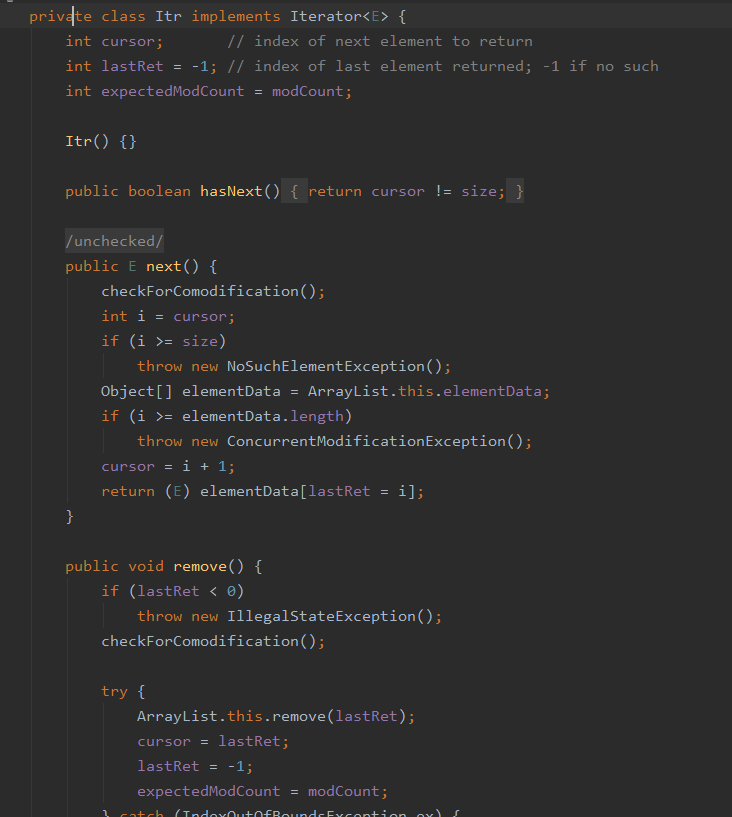

&nbsp;&nbsp;&nbsp;&nbsp;编程过程中常常需要使用到集合，而ArrayList也是我们常常使用的，但是最近在一次删除和增加中出现了一些问题，分享记录下。
&nbsp;&nbsp;&nbsp;&nbsp;请看下面两段代码，哪段代码会报错呢，或者都成功呢？
```java
List<String> arrayList1 = new ArratList<String>();
arrayList1.add("1");
arrayList1.add("2");
for(String s : arrayList1) {
    if("1".equals(s)) {
        arrayList1.remove(s);
    }
}

List<String> arrayList2 = new ArratList<String>();
arrayList2.add("2");
arrayList2.add("1");
for(String s : arrayList2) {
    if("1".equals(s)) {
        arrayList2.remove(s);
    }
}
```
<!-- more -->&nbsp;&nbsp;&nbsp;&nbsp;程序运行结果如下：
&nbsp;&nbsp;&nbsp;&nbsp;&nbsp;&nbsp;&nbsp;&nbsp;arrayList1的remove方法成功执行，但是arrayList2的remove方法运行抛出ConcurrentModificationException异常。
&nbsp;&nbsp;&nbsp;&nbsp;为了寻找原因，我们只能看源码了。因为foreach的本质就是使用迭代器Iterator，所有的Collection集合类都会实现Iterable接口。
&nbsp;&nbsp;&nbsp;&nbsp;找到ArrayList类的iterator()方法：
```java
public Iterator<E> iterator() {
    return new Itr();
}
```
&nbsp;&nbsp;&nbsp;&nbsp;使用自己的Itr内部类，并且实现了Iterator接口。
&nbsp;&nbsp;&nbsp;&nbsp;迭代器的本质是先调用hasNext()方法判断存不存在下一个元素，然后再使用next()方法取下一个元素

&nbsp;&nbsp;&nbsp;&nbsp;上面arrayList1为什么能remove成功呢，其实它只循环了一次，所以成功了。因为他在remove元素1之后，它的size-1变成1，然后Itr内部的cursor变量由0变成1，此时1=1，循环结束，所以成功了。
&nbsp;&nbsp;&nbsp;&nbsp;arrayList2为什么remover失败呢，因为它在循环第二次的时候，也remove成功了，但是第三次判断next的时候，cursor的值为2，导致不等于现在的size 1，最重要的来了，之前remove的操作导致ArrayList的modCount值加1，然后Itr类中的expectedModCount保持不变，所以会抛出异常。
```java
final void checkForComodification() {
    if(modCount != expectedModCount) {
        throw new ConcurrentModificationException();
    }
}
```
&nbsp;&nbsp;&nbsp;&nbsp;同理可得，由于add操作也会导致modCount自增，所以不允许在foreach中删除、增加、修改ArrayList中的元素。
&nbsp;&nbsp;&nbsp;&nbsp;对此，推荐大家使用迭代器Iterator删除元素。
```java
Iterator<String> iterator = arrayList2.iterator();
while(iterator.hasNext()) {
    String item = item.next()'
    if("1".equals(item)) {
        iterator.remove();
    }
}
```
&nbsp;&nbsp;&nbsp;&nbsp;如果存在并发操作，还需要对Iterator进行加锁操作。