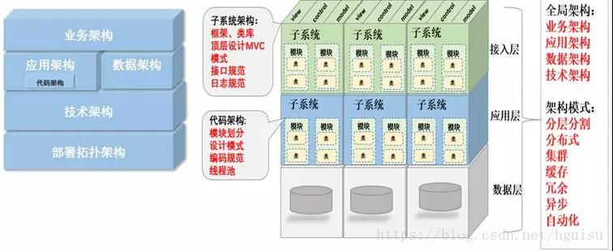
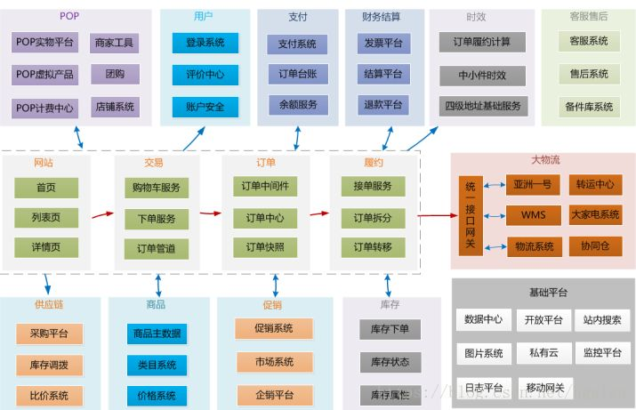

<b style="color: orangered">一.什么是架构和架构本质</b>
&nbsp;&nbsp;&nbsp;&nbsp;在软件行业，对于什么是架构，都有很多的争论，每个人都有自己的理解。此君说的架构和彼君理解的架构未必是一回事。因此我们在讨论架构的概念定义，概念是人认识这个世界的基础，并用来沟通的手段，如果对架构概念理解不一样，那沟通起来自然不顺畅。
&nbsp;&nbsp;&nbsp;&nbsp;Linux有架构，MySQL有架构，JVM也有架构，使用java开发、MySQL存储、跑在Linux上的业务系统也有架构，应该关注哪一个？想要清楚以上问题需要梳理几个有关系又相似的概念：系统与子系统、模块和组件、框架和架构：
<!-- more -->
&nbsp;&nbsp;&nbsp;&nbsp;<b style="color: #6A6AFF">1.1系统与子系统</b>
&nbsp;&nbsp;&nbsp;&nbsp;&nbsp;&nbsp;&nbsp;&nbsp;系统：泛指由一群有关联的个体组成，根据某种规则运作，能完成个别元件不能独立完成的工作能力的群体。
&nbsp;&nbsp;&nbsp;&nbsp;&nbsp;&nbsp;&nbsp;&nbsp;子系统：也是由一群关联的个体组成的系统，多半是在更大的系统中的一部分。
&nbsp;&nbsp;&nbsp;&nbsp;<b style="color: #6A6AFF">1.2模块与组件</b>
&nbsp;&nbsp;&nbsp;&nbsp;&nbsp;&nbsp;&nbsp;&nbsp;都是系统的组成部分，从不同角度拆分系统而已。模块是逻辑单元，组件是物理单元。
&nbsp;&nbsp;&nbsp;&nbsp;&nbsp;&nbsp;&nbsp;&nbsp;模块就是从逻辑上将系统分解，即分而治之，将复杂问题简单化。模块的粒度可大可小，可以是系统，几个子系统、某个服务、函数、类、方法、功能块等等。
&nbsp;&nbsp;&nbsp;&nbsp;&nbsp;&nbsp;&nbsp;&nbsp;组件可以包括应用服务、数据库、网络、物理机、还可以包括MQ、容器、Nginx等技术组件。
&nbsp;&nbsp;&nbsp;&nbsp;<b style="color: #6A6AFF">1.3框架与架构</b>
&nbsp;&nbsp;&nbsp;&nbsp;&nbsp;&nbsp;&nbsp;&nbsp;框架是组件实现的规范，例如：MVC、MVP、MVVM等，是提供基础功能的产品，例如开源框架：Ruby on Redis、Spring、Laravel、Django等，这是可以拿来直接使用或者在此基础上二次开发。
&nbsp;&nbsp;&nbsp;&nbsp;&nbsp;&nbsp;&nbsp;&nbsp;框架是规范，架构是结构。
&nbsp;&nbsp;&nbsp;&nbsp;&nbsp;&nbsp;&nbsp;&nbsp;重新定义架构：软件架构指软件系统的顶层结构。
&nbsp;&nbsp;&nbsp;&nbsp;&nbsp;&nbsp;&nbsp;&nbsp;架构是经过系统性思考，权衡利弊之后在现有资源约束下的最合理决策，最终明确的系统骨架，包括子系统、模块、组件、以及他们之间的协作关系、约束规范、指导原则，并由它来指导团队中的每个人思想层面上的一致。涉及四方面：
- 系统性思考的合理决策：比如技术选型、解决方案等。
- 明确的系统骨架：明确系统有哪些部分组成。
- 系统协作关系：各个组成部分如何协作来实现业务请求。
- 约束规范和指导原则：保证系统有序、高效、稳定运行。
&nbsp;&nbsp;&nbsp;&nbsp;&nbsp;&nbsp;&nbsp;&nbsp;因此架构师具备能力：<b>理解业务，把控全局，选择合适技术，解决关键问题、指导研发落地实施</b>。
&nbsp;&nbsp;&nbsp;&nbsp;&nbsp;&nbsp;&nbsp;&nbsp;架构的本质就是对系统进行有序化地重构以致符合当前业务的发展，并可以快速扩展。
&nbsp;&nbsp;&nbsp;&nbsp;&nbsp;&nbsp;&nbsp;&nbsp;那什么样的系统要求做架构设计，技术不会平白无故的出现和自驱动发展起来，而架构的发展和需求是基于业务的驱动。
&nbsp;&nbsp;&nbsp;&nbsp;&nbsp;&nbsp;&nbsp;&nbsp;架构设计完全是为了业务：
- 需求相对复杂
- 非功能性需求在整个系统占据重要位置
- 系统生命周期长，有扩展性需求
- 系统基于组件或者集成的需要
- 业务流程再造的需要
<b style="color: orangered">二.架构分层和分类</b>
&nbsp;&nbsp;&nbsp;&nbsp;架构分类可细分为业务架构、应用架构、技术架构、部署架构。

&nbsp;&nbsp;&nbsp;&nbsp;业务架构是战略，应用架构是技术，技术架构是装备。其中应用架构承上启下，一方面承接业务架构的落地，另一方面影响技术选型。
&nbsp;&nbsp;&nbsp;&nbsp;熟悉业务，形成业务架构，根据业务架构，做出相应的应用架构，最后技术架构落地实施。
&nbsp;&nbsp;&nbsp;&nbsp;如何针对当前需求，选择合适的应用架构，如何面对未来，保证架构平滑过渡，这个是软件开发者，特别是架构师，都需要深入思考的问题。
&nbsp;&nbsp;&nbsp;&nbsp;<b style="color: #6A6AFF">2.1业务架构(俯视架构)</b>
&nbsp;&nbsp;&nbsp;&nbsp;&nbsp;&nbsp;&nbsp;&nbsp;包括业务规划、业务模块、业务流程，对整个系统的业务进行拆分，对领域模型进行设计，把现实的业务转化为抽象对象。
&nbsp;&nbsp;&nbsp;&nbsp;&nbsp;&nbsp;&nbsp;&nbsp;没有最优的架构，只有最合适的架构，一切系统设计原则都要以解决业务问题为最终目标，脱离实际业务的技术情怀架构往往会给系统带入大坑，任何不基于业务做异想天开的架构都是耍流氓。
&nbsp;&nbsp;&nbsp;&nbsp;&nbsp;&nbsp;&nbsp;&nbsp;所有问题的前提是要搞清楚我们今天面临的业务量有多大，增长走势是什么样，而且解决高并发的过程一定是一个循序渐进的过程。合理的架构能够提前预见业务发展1~2年为宜。这样可以付出较为合理的代价来真正达到技术引领业务成长的效果。

&nbsp;&nbsp;&nbsp;&nbsp;<b style="color: #6A6AFF">2.2应用架构(剖面架构，也叫逻辑架构图)</b>