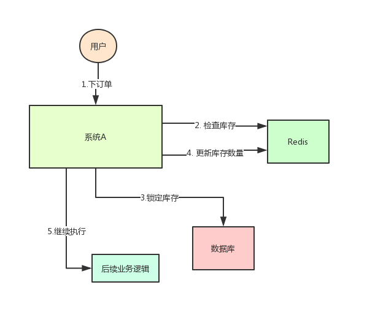
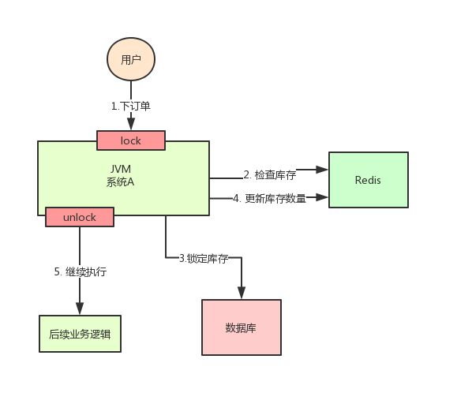
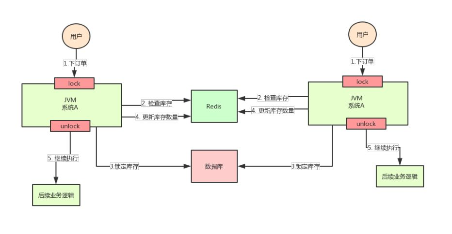
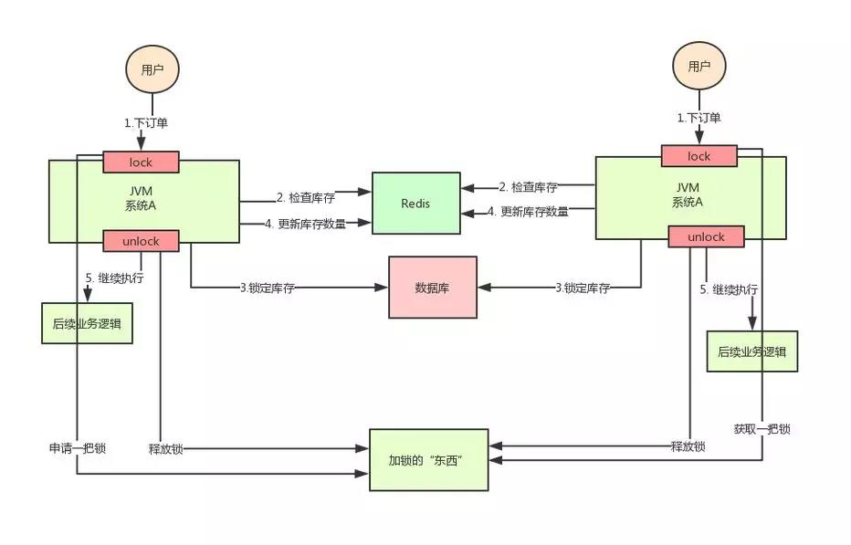
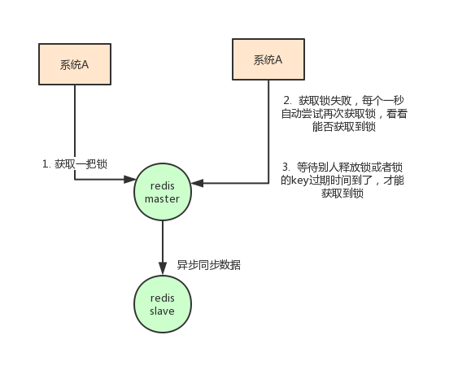
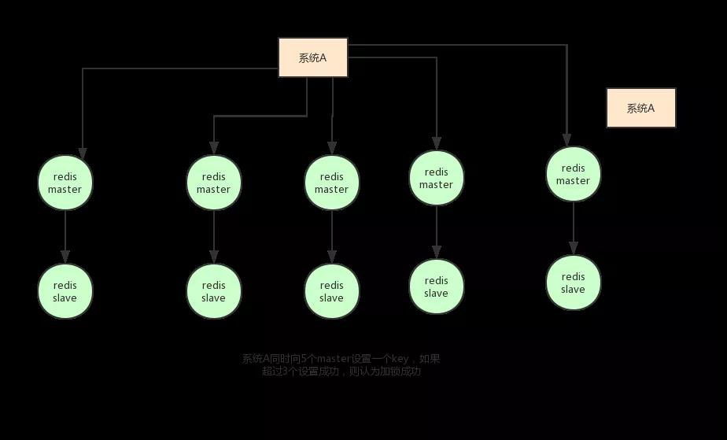
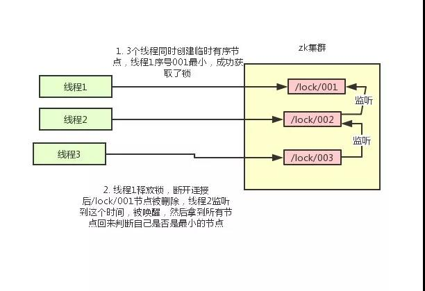
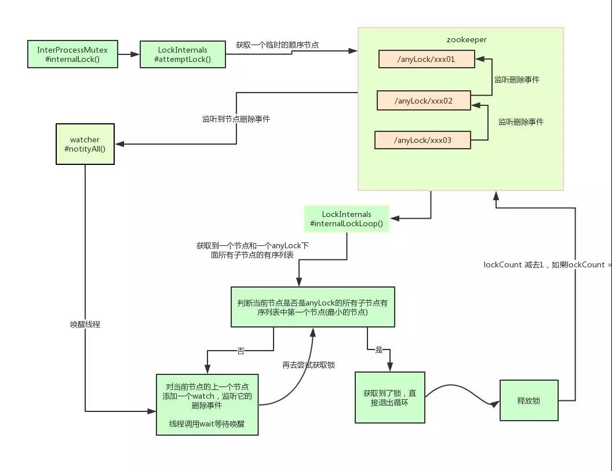

<b style="color: orangered">为什么用分布式锁？</b>
&nbsp;&nbsp;&nbsp;&nbsp;在讨论这个问题之前，我们先来看一个业务场景：
&nbsp;&nbsp;&nbsp;&nbsp;&nbsp;&nbsp;&nbsp;&nbsp;系统A是一个电商系统，目前是一台机器部署，系统中有一个用户下订单的接口，但是用户下订单之前一定要去检查一下库存，确保库存足够了才会给用户下单。
&nbsp;&nbsp;&nbsp;&nbsp;&nbsp;&nbsp;&nbsp;&nbsp;由于系统有一定的并发，所以会预先将商品的库存保存在redis中，用户下单的时候会更新redis的库存。<!-- more -->
&nbsp;&nbsp;&nbsp;&nbsp;此时系统架构如下：

&nbsp;&nbsp;&nbsp;&nbsp;但是这样一来会产生一个问题：假如某个时刻，redis里面的某个商品库存为1，此时两个请求同时到来，其中一个请求执行到上图的第3步，更新数据库的库存为0，但是第4步还没有执行。而另外一个请求执行到了第2步，发现库存还是1，就继续执行第3步。这样的结果是导致卖出了2个商品，然而其实库存只有1个。很明显不对啊！这就是典型的<b style="color: #CC3299">库存超卖问题</b>。
&nbsp;&nbsp;&nbsp;&nbsp;此时，我们很容易想到解决方案，用锁把2、3、4步锁住，让他们执行完之后，另一个线程才能进来执行第2步。

&nbsp;&nbsp;&nbsp;&nbsp;按照上面的图，在执行第2步时，使用java提供的synchronized或者ReentrantLock来锁住，然后在第4步执行完之后才释放锁。这样一来，2、3、4这3个步骤就被"锁"住了，多个线程之间只能串行化执行。
&nbsp;&nbsp;&nbsp;&nbsp;但是好景不长，整个系统的并发飙升，一台机器扛不住了。现在要增加一台机器，如下图：

&nbsp;&nbsp;&nbsp;&nbsp;增加机器后，系统变成上图所示。假设此时两个用户的请求同时到来，但是落在了不同的机器上，那么这两个请求是可以同时执行了，还是会出现<b style="color: #CC3299">库存超卖</b>的问题。
&nbsp;&nbsp;&nbsp;&nbsp;为什么呢？因为上图中的两个A系统，运行在两个不同的JVM里面，他们加的锁只对属于自己JVM里面的线程有效，对于其他JVM的线程是无效的。因此，这里的问题是：<b style="color: #CC3299">Java提供的原生锁机制在多机部署场景下失效了。</b>这是因为两台机器加的锁不是同一个锁(两个锁在不同的JVM里面)。那么，我们只要保证两台机器加的锁是同一个锁，问题不就解决了吗？
&nbsp;&nbsp;&nbsp;&nbsp;此时，就该<b style="color: #CC3299">分布式锁</b>隆重登场，分布式锁的思路是：
&nbsp;&nbsp;&nbsp;&nbsp;&nbsp;&nbsp;&nbsp;&nbsp;在整个系统提供一个全局、唯一的获取锁的“东西”，然后每个系统在需要加锁时，都去问这个“东西”拿到一把锁，这样不同的系统拿到的就可以认为是同一把锁。
&nbsp;&nbsp;&nbsp;&nbsp;至于这个“东西”，可以是Redis、Zookeeper，也可以是数据库。

&nbsp;&nbsp;&nbsp;&nbsp;通过上面的分析，我们知道了库存超卖场景在分布式部署系统的情况下使用java原生的锁机制无法保证线程安全，所以我们需要用到分布式锁的方案。
<b style="color: orangered">基于Redis实现分布式锁</b>
&nbsp;&nbsp;&nbsp;&nbsp;上面分析为啥要使用分布式锁了，这里我们来具体看看分布式锁落地的时候应该怎么处理。
&nbsp;&nbsp;&nbsp;&nbsp;最常见的一种方案就是使用<b style="color: #CC3299">Redis做分布式锁</b>。使用Redis做分布式锁的思路大概是这样的：在Redis中设置一个值表示加了锁，然后释放锁的时候就把这个这个key删除。
&nbsp;&nbsp;&nbsp;&nbsp;具体代码是这样的：
```java
// 获取锁
// NX是指如果key不存在就成功，key存在返回false，PX可以指定过期时间
SET anyLock unique_value NX PX 30000

// 释放锁：通过执行一段lua脚本
// 释放锁涉及到两条指令，这两条指令不是原子性的
// 需要用到redis的lua脚本支持特性，redis执行lua脚本是原子性的
if redis.call("get",KEYS[1] == ARGV[1] then
return redis.call("del", KEYS[1])
else
return 0
end
```
&nbsp;&nbsp;&nbsp;&nbsp;这种方式有几大要点：
- <b>一定要用SET key value NX PX millisenconds命令</b>。如果不用，先设置了值，再设置过期时间，这个不是原子性操作，有可能再设置过期时间之前宕机，会造成死锁(key永久存在)
- <b>value要具有唯一性</b>。这个是为了在解锁的时候，需要验证value是和加锁的一致才删除key。
&nbsp;&nbsp;&nbsp;&nbsp;&nbsp;&nbsp;&nbsp;&nbsp;这是避免了一种情况：假设A获取了锁，过期时间30s，此时35s之后，锁已经自动释放了，A去释放锁，但是此时可能B获取了锁。A客户端就不能删除B的锁了。

&nbsp;&nbsp;&nbsp;&nbsp;除了要考虑客户端要怎么实现分布式锁之外，还需要考虑redis的部署问题。
&nbsp;&nbsp;&nbsp;&nbsp;Redis有3种部署方式：
- 单机模式
- master-slave + sentinel选举模式
- redis cluster模式
&nbsp;&nbsp;&nbsp;&nbsp;使用redis做分布式锁的缺点在于：如果采用单机部署模式，会存在单点问题，只有redis故障了，加锁就不行了。
&nbsp;&nbsp;&nbsp;&nbsp;采用master-slave模式，加锁的时候只会对一个节点加锁，即便通过sentinel做了高可用，但是如果master节点故障了，发生主从切换，此时就会有可能出现锁丢失的问题。
&nbsp;&nbsp;&nbsp;&nbsp;基于以上的考虑，其实redis的作者也考虑到这个问题，他提出了一个RedLock的算法，这个算法的意思大概是这样的：
&nbsp;&nbsp;&nbsp;&nbsp;&nbsp;&nbsp;&nbsp;&nbsp;假设redis的部署模式是redis cluster，总共有5个master节点，通过以下步骤获取一把锁：
- 获取当前时间戳，单位是毫秒
- 轮流尝试在每个master节点上创建锁，过期时间设置较短，一般就几十毫秒
- 尝试在大多数节点上建立一个锁，比如5个节点就要求是3个节点(n/2 + 1)
- 客户端计算建立好锁的时间，如果建立锁的时间小于超时时间，就算建立成功了
- 要是锁建立失败了，那么就依次删除这个锁
- 只要别人建立一把分布式锁，你就得不断轮询去尝试获取锁
&nbsp;&nbsp;&nbsp;&nbsp;但是这样的这种算法还是颇具争议的，可能还会存在不少的问题，无法保证加锁的过程一定正确。

<b style="color: orangered">Redisson</b>
&nbsp;&nbsp;&nbsp;&nbsp;此外，实现Redis的分布式锁，除了自己基于redis client原生api来实现之外，还可以使用开源框架：Redisson。
&nbsp;&nbsp;&nbsp;&nbsp;Redisson是一个企业级的开源Redis Client，也提供了分布式锁的支持。非常推荐大家使用。
&nbsp;&nbsp;&nbsp;&nbsp;回想一下上面说的，如果自己写代码来通过redis设置一个值，是通过下面这个命令设置的。
- SET anyLock unique_value NX PX 30000
&nbsp;&nbsp;&nbsp;&nbsp;这里设置的超时时间是30s，假如我超过30s都还没有完成业务逻辑的情况下，key会过期，其他线程有可能会获取到锁。这样一来的话，第一个线程还没执行完业务逻辑，第二个线程进来了也会出现线程安全问题。所以我们还需要额外的去维护这个过期时间，太麻烦了。
&nbsp;&nbsp;&nbsp;&nbsp;我们来看看redisson是怎么实现的：
```java
Config config = new Config();
Config.useClusterServers()
.addNodeAddress("redis://192.168.31.101:7001")
.addNodeAddress("redis://192.168.31.101:7002")
.addNodeAddress("redis://192.168.31.101:7003")
.addNodeAddress("redis://192.168.31.102:7001")
.addNodeAddress("redis://192.168.31.102:7002")
.addNodeAddress("redis://192.168.31.102:7003")

RedissonClient redisson = Redisson.create(config);

RLock lock = redisson.getLock("anyLock");
lock.lock();
lock.unlock();
```
&nbsp;&nbsp;&nbsp;&nbsp;就是这么简单，我们只需要通过它的api中的lock和unlock即可完成分布式锁，他帮我们考虑了很多细节：
- redisson所有指令都通过lua脚本执行，redis支持lua脚本原子性运行
- redisson设置一个key的默认过期时间为30s，如果某个客户端持有一个锁超过了30s怎么办？
   - redisson中有一个watchdog的概念，翻译过来就是看门狗，它会在你获取锁之后，每隔10s帮你把key的超时时间设为30s，这样的话，就算一直持有锁也不会出现key过期了，其他线程获取到锁的问题。
- redisson的“看门狗”逻辑保证了没有死锁发生。(如果机器宕机了，看门狗也就没了。此时就不会延长key的过期时间，到了30s之后就会自动过期了，其他线程可以获取到锁)

&nbsp;&nbsp;&nbsp;&nbsp;这里稍微贴出来其 实现代码：
```java
// 加锁逻辑
private <T> RFuture<Long> tryAcquireAsync(long leaseTime, TimeUnit unit, final long threadId) {
    if (leaseTime != -1) {
        return tryLockInnerAsync(leaseTime, unit, threadId, RedisCommands.EVAL_LONG);
    }		
    // 调用一段lua脚本，设置一些key、过期时间
    RFuture<Long> ttlRemainingFuture = tryLockInnerAsync(commandExcutor.getConnectionManager().getCfg().getLockWatchdogTimeout(), TimeUnit.MILLISENCONDS, threadId, RedisCommands.EVAL_LONG);
    ttlRemainingFuture.addListener(new FutureListener<Long>(){
        @Override
        public void operationComplete(Future<Long> future) throws Exception {
            if (!future.isSuccess()) {
                return ;
            }
 
            Long ttlRemaining = future.getNow();
            // lock acquired
            if (ttlRemaining == null) {
                // 看门狗逻辑
                scheduleExpirationRenewal(threadId);
            } 								
        } 				
    });
    return ttlRemainingFuture;		
}

<T> RFuture<T> tryLockInnerAsync(long leaseTime, TimeUnit unit, long threadId, RedisStrictCommand<T> command) {
    internalLockLeaseTime = unit.toMills(leaseTime);

    return commandExcutor.evalWriteAsync(getName(), LongCodec.INSTANCE, command,
        "if (redis.call('exists',KEYS[1]) == 0) then " +
            "redis.call('hset', KEYS[1], ARGV[2], 1); " +
            "redis.call('pexpire', KEYS[1], ARGV[1]); " +
            "return nil; " +
        "end; " +
        "if (redis.call('hexists', KEYS[1], ARGV[2]) == 1) then " +
            "redis.call('hincrby', KEYS[1], ARGV[2], 1); " +
            "redis.call('pexpire', KEYS[1], ARGV[1]); " +
            "return nil; " +
        "end; " +
        "return redis.call('pttl', KEYS[1]);",
        Collections.<Object>singletonList(getName()), internalLockLeaseTime, getLockName(threadId)				
    );		
}

// 看门狗最终会调用这里
private void scheduleExpirationRenewal(final long threadId) {
    if (expirationRenewalMap.containsKey(getEntryName())) {
        return;
    }

    // 这个任务会延迟10s执行
    Timeout task = commandExcutor.getConnectionManager().newTimeout(new TimerTask() {
        @Override
        public void run(Timeout timeout) throws Exception {

            // 这个操作会将key的过期时间重新设置为30s
            RFuture<Boolean> future = renewExpirationAsync(threadId);

            future.addListener(new FutureListener<Boolean>(){
                @Override
                public void operationComplete(Future<Boolean> future) throws Exception {
                    expirationRenewalMap.remove(getEntryName());
                    if (!future.isSuccess()) {
                        log.error("Can't update lock " + getName() + " expiration", future.cause());
                        return;												
                    }

                    if (future.getNow()) {
                        // reschedule iteself
                        // 通过递归调用本方法，无限循环延长过期时间
                        scheduleExpirationRenewal(threadId); 												
                    }										
                } 								
            }); 						
        }				
    }, internalLockLeaseTime / 3, TimeUnit.MILLISENCONDS);

    if (expirationRenewalMap.putIfAbsent(getEntryName(), new ExpirationEntry(threadId, task)) != null) {
        task.cancel();
    }		
}
```
&nbsp;&nbsp;&nbsp;&nbsp;另外，redisson还提供了对redlock算法的支持。它的用法也很简单：
```java
RedissonClient redisson = Redisson.create(config);
RLock lock1 = redisson.getFairLock("lock1");
RLock lock2 = redisson.getFairLock("lock2");
RLock lock3 = redisson.getFairLock("lock3");
RedissonRedLock muiltLock = new RedisdonRedLock(lock1, lock2, lock3);
muiltLock.lock();
muiltLock.unlock();
```
&nbsp;&nbsp;&nbsp;&nbsp;<b style="color: #6A6AFF">小结：</b>
&nbsp;&nbsp;&nbsp;&nbsp;&nbsp;&nbsp;&nbsp;&nbsp;本文分析了使用redis作为分布式锁的具体落地方案以及其一些局限性，然后介绍了一个redis的客户端redisson。这也是我推荐大家使用的，比自己写代码实现会少关心很多细节。
<b style="color: orangered">基于zookeeper实现分布式锁</b>
&nbsp;&nbsp;&nbsp;&nbsp;常见的分布式锁实现方案里面，除了使用redis来实现之外，使用zookeeper也可以实现分布式锁。
&nbsp;&nbsp;&nbsp;&nbsp;在介绍zookeeper实现分布式锁的机制之前，先粗略介绍一下zk是什么东西：
&nbsp;&nbsp;&nbsp;&nbsp;&nbsp;&nbsp;&nbsp;&nbsp;zk是一种提供配置管理、分布式协同以及命名的中心化服务。
&nbsp;&nbsp;&nbsp;&nbsp;zk的模型是这样的：zk包含一系列节点，叫做znode，就好像文件系统一样，每个znode表示一个目录，然后znode有一些特性：
- <b>有序节点</b>：假如当前有一个父节点为/lock，我们可以在这个父节点下面创建子节点；zk提供了一个可选的有序特性，例如我们可以创建子节点"/lock/node-"并且指明有序，那么zk在生成子节点会根据当前的子节点数量自动添加整数序号。也就是说，如果是第一个创建的子节点，那么生成的子节点为/locl/node-00000000,下一个节点则为/lock/node-00000001,依次类推。
- <b>临时节点</b>：客户端可以建立一个临时节点，在会话结束或者会话超时后，zk会自动删除该节点。
- <b>事件监听</b>：在读取数据时，我们可以同时对节点设置事件监听，当节点数据或结构发生变化时，zk会通知客户端。当前zk有如下四种事件：
   - 节点创建
   - 节点删除
   - 节点数据修改
   - 子节点变更
&nbsp;&nbsp;&nbsp;&nbsp;基于以上的一些zk的特性，我们很容易得出使用zk实现分布式锁的落地方案：
&nbsp;&nbsp;&nbsp;&nbsp;&nbsp;&nbsp;&nbsp;&nbsp;1.使用zk的临时节点和有序节点，每个线程获取锁就是在zk创建一个临时有序的节点，比如在/lock/目录下。
&nbsp;&nbsp;&nbsp;&nbsp;&nbsp;&nbsp;&nbsp;&nbsp;2.创建节点成功后，获取/lock目录下的所有临时节点，在判断当前线程创建的节点是否是所有节点的序号最小的节点。
&nbsp;&nbsp;&nbsp;&nbsp;&nbsp;&nbsp;&nbsp;&nbsp;3.如果当前线程创建的节点不是所有节点序号最小的节点，则对节点序号的前一个节点添加一个事件监听。比如当前线程获取到的节点序号为/lock/003，然后所有的节点列表为[/lock/001, /lock/002, /lock/003],则对/lock/002这个节点添加一个事件监听器。
&nbsp;&nbsp;&nbsp;&nbsp;&nbsp;&nbsp;&nbsp;&nbsp;如果锁释放了，会唤醒下一个序号的节点，然后重新执行第3步，判断是否自己的节点序号最小。比如/lock/001释放了，/lock/002监听到事件，此时节点集合为[/lock/002, /lock/003],则/lock/002为最小序号，获取到锁。
&nbsp;&nbsp;&nbsp;&nbsp;&nbsp;&nbsp;&nbsp;&nbsp;整个过程如下：

<b style="color: orangered">Curator介绍</b>
&nbsp;&nbsp;&nbsp;&nbsp;Curator是一个zk的开源客户端，也提供了分布式锁的实现。
&nbsp;&nbsp;&nbsp;&nbsp;它的使用方式也比较简单:
```java
InterProcessMutex interProcessMutex = new InterProcessMutex(client, "/anyLock");
interProcessMutex.acquire();
interProcessMutex.release();
```
&nbsp;&nbsp;&nbsp;&nbsp;其实现分布式锁的核心源码如下：
```java
private boolean internalLockLoop(long startMillis, long mullisToWait, String ourPath) throws Exception {
    boolean haveTheLock = false;
    boolean doDelete = false;
    try {
        if (revocable.get() != null) {
            client.getData().usingWatcher(revocableWatcher).forPath(ourPath);
        }

        while ((client.getState() == CuratorFrameworkState.STARTED) && !haveTheLock) {
            // 获取当前所有节点排序后的集合
            List<String> children = getSortedChildren();
            // 获取当前节点的名称
            String sequenceNodeName = ourPath.substring(basePath.length() + 1); // +1 to include the slash
            // 判断当前节点是否是最小的节点
            PredicateResults predicatResults = driver.getsTheLock(client, children, sequenceNodeName, maxLeases);
            if (predicatResults.getsTheLock()) {
                // 获取到锁
                haveTheLock = true;								
            } else {
                // 没获取到锁，对当前节点的上一个节点注册一个监听器
                String previousSequencePath = basePath + "/" + predicatResults.getPathToWatch();
                synchronized(this) {
                    Stat stat = client.checkExists().usingWatcher(watcher).forPath(previousSequencePath);
                    if (stat != null) {
                        if (mullisToWait != null) {
                            mullisToWait -= (System.currentTimeMillis() - startMillis);
                            startMillis = System.currentTimeMillis;
                            if (millisToWait <= 0) {
                                doDelete = true; // time out - delete our mode
                                break;																
                            }
                            wait(millisToWait);														
                        } else {
                            wait();
                        }												
                    } 										
                }
                // else if may have been deleted (i.e lock released). Try to acquire again								
            }						
        }				
    } catch (Exception e) {
        doDelete = true;
        throw e;				
    } finally {
        if (doDelete) {
            deleteOurPath(ourPath);
        }				
    }
    return haveTheLock; 		
}
```
&nbsp;&nbsp;&nbsp;&nbsp;其实curator实现分布式锁的底层原理和上面分析的是差不多的。这里我们用一张图详细描述其原理：

&nbsp;&nbsp;&nbsp;&nbsp;小结：
&nbsp;&nbsp;&nbsp;&nbsp;&nbsp;&nbsp;&nbsp;&nbsp;本文介绍了zk实现分布式锁的方案以及zk的开源客户端的基本使用，简要的介绍了其实现原理。
<b style="color: orangered">建议</b>
&nbsp;&nbsp;&nbsp;&nbsp;通过前面的分析，实现分布式锁的两种常见方案：redis和zk，他们各有千秋。应该如何选型呢？就个人而言，比较推崇zk实现的锁。因为redis是有可能存在隐患的，可能会导致数据不对的情况。但是，怎么选用要看具体在公司的场景了。如果公司里面有zk集群条件，优先选用zk实现，但是如果说公司里面只有redis集群，没有条件搭建zk集群。那么其实用redis来实现也可以，另外还可能是系统考虑者考虑到系统已有redis，但是又不希望再次引入一些外部依赖的情况下，可以选用redis。这个就是要系统设计者基于架构的考虑了。