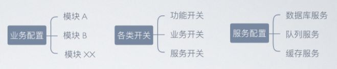
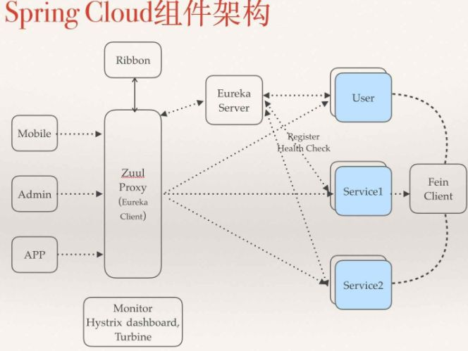

<b style="color: orangered">服务架构</b>
&nbsp;&nbsp;&nbsp;&nbsp;为了方便理解，我先讲一个小故事：(改编自一知乎答主)
&nbsp;&nbsp;&nbsp;&nbsp;Martin(微服务提出者也叫Martin)刚来到公司时是一个基层员工，它上面有经理、老板，那个时候所有人都听老板的指挥。但是过了两年，公司的人越来越多，原来的模式下整个公司的运作效率太低，管理也很混乱。于是已经踏上中层岗位的Martin建议老板进行部门划分(服务化)，专门的部门只做专门的事情(单一职责)。例如：研发部门只做研发，人事部门只做招聘。老板听取了Martin的意见，对公司的组织架构进行了调整。
&nbsp;&nbsp;&nbsp;&nbsp;有一天，Martin发现公司的部门越来越多，各个部门并不能完全知道对方所做的事情，这对跨部门协作(服务调用)带来了困难。行政部门会(服务注册)来记录所有的部门，每当有新的部门行政都会记录下来(服务注册)，然后公布出来让所有部门知道(服务发现)。在新的组织架构下，公司的效率逐步提高。老板也给Martin发了大量奖金作为奖励，Martin从此走上了人生巅峰。<!-- more -->
&nbsp;&nbsp;&nbsp;&nbsp;这是一个公司组织架构演变的故事，主要讲的是随着公司规模的扩大，组织从集中化管理到分布化管理的过程。映射到我们的信息系统里来也是一样的，随着我们的系统越来越复杂，变得难以管理，也会有人想到去拆分然后治理。在解决复杂问题上，分治可以说是一个屡试不爽的办法。
&nbsp;&nbsp;&nbsp;&nbsp;服务化即是拆解的一种手段。而上面圆括号里面的内容其实就是对应了一个服务化架构的最小组成元素，分别是服务、服务调用、注册中心、服务注册、服务发现。有了这些基本的组成要素，就可以实现一个最简单的服务架构。
&nbsp;&nbsp;&nbsp;&nbsp;<b style="color: #6A6AFF">面向服务的架构和微服务架构：</b>
&nbsp;&nbsp;&nbsp;&nbsp;&nbsp;&nbsp;&nbsp;&nbsp;面向服务的架构(SOA)和微服务架构是目前两种主流的服务化架构，都符合上面的例子，也有上面提到的所有组件。这两种服务架构有很多可以讲的，但是与本文的相关性不大，本文不会做过多展开，只是简单介绍一下两者的区别。
&nbsp;&nbsp;&nbsp;&nbsp;&nbsp;&nbsp;&nbsp;&nbsp;准确地说微服务是去ESB(企业服务总线)的SOA。ESB借鉴了计算机组成原理中的通信模型-总线，所有需要和外部系统通信的系统，通过ESB进行标准化地转换从而消除协议、异构系统之间的差异，这样就可以利用现有的系统构建一个全新的松耦合的异构的分布式系统。微服务架构去掉ESB，本质上是一种去中心化的思想。
<b style="color: orangered">五脏六腑</b>
&nbsp;&nbsp;&nbsp;&nbsp;顺着上一节的思路，从最简单、最核心的问题出发，假设服务A要调用服务B，会有什么问题？
- 服务在哪？(服务治理问题)
- 怎么调用？(服务调用问题)
&nbsp;&nbsp;&nbsp;&nbsp;这两个是最核心的问题，也是任何微服务架构首要解决的问题。
&nbsp;&nbsp;&nbsp;&nbsp;为了解决第一个问题，Spring Cloud提供了Eureka、Zookeeper、Cloud Foundry、Consul等服务治理框架的集成。他们的工作模式是将所有的微服务注册到一个Server上，然后通过心跳进行服务健康监测。这样服务A调用B时可以从注册中心拿到可用的服务B的地址、端口进行调用。
&nbsp;&nbsp;&nbsp;&nbsp;第二个服务调用有人可能认为就是一个简单的HTTP或者RPC调用，不是什么问题。但是在分布式的场景下，服务调用需要考虑的因素会更多。比如一个服务有多个实例，此时请求进来了交给谁处理，处理的负载怎么平衡到各个实例，都是比较棘手的问题。Spring Cloud提供了两种服务调用的方式：一种是Ribbon+restTemplate，另一种是Feign。
&nbsp;&nbsp;&nbsp;&nbsp;其实Ribbon是基于HTTP和TCP客户端的负载均衡器，restTemplate是Spring提供的Restful远程调用的模板，两者结合就可以达到远程调用的负载均衡。
&nbsp;&nbsp;&nbsp;&nbsp;而Feign是一个更加声明式的HTTP客户端，开发者可以像调用本地方法一样调用它，完全感觉不到是远程调用，结合Ribbon也可以做负载均衡。
&nbsp;&nbsp;&nbsp;&nbsp;既然两个问题都得到了解决，我们就用一个例子进一步说明一下，例子包含了微服务最基本的三个角色(注册中心、服务提供者、服务消费者)。
<b style="color: orangered">注册中心</b>
&nbsp;&nbsp;&nbsp;&nbsp;注解@EnableEurekaServer表示该Springboot应用是一个注册中心。
```java
@EnableEurekaServer
@SpringBootApplication
public class EurekaserverApplication {
    public static void main(String[] args) {
        SpringApplication.run(EurekaserverApplication.class, args);
    }
}
```
&nbsp;&nbsp;&nbsp;&nbsp;eureka.client.registerWithEureka:false和fetchRegistry:false来表明自己是一个eureka server。
```yml
server:
  port: 8080

eureka:
  instance:
    hostname: localhost
  client:
    registerWithEureka: false
    fetchRegistry: false
    serviceUrl:
      defaultZone: http://${eureka.instance.hostname}:${server.port}/eureka/
```
&nbsp;&nbsp;&nbsp;&nbsp;service-hello服务:注解@EnableEurekaClient表示它是一个Eureka客户端，它会在注册中心注册自己。
&nbsp;&nbsp;&nbsp;&nbsp;注解@RestController表示这是一个控制器，@RequestMapping("/hello")表示匹配到请求'hello'时会调用该方法进行响应。
```java
@SpringBootApplication
@EnableEurekaClient
@RestController
public class ServiceHelloApplication {
    public static void main(String[] args) {
        SpringApplication.run(ServiceHelloApplication.class, args);
    }
    
    @Value("${service.port}")
    String port;
    @RequestMapping("hello")
    public String home(RequestParam String name){
        return "hello " + name + ", i am from port:" + port;
    }
}
```
&nbsp;&nbsp;&nbsp;&nbsp;注册中心的地址为：[http://localhost:8080/eureka/](http://localhost:8080/eureka/),也就是上面我们定义的。服务名为service-hello,将会被调用者使用。
```java
eureka:
  client:
    serviceUrl:
      defaultZone:http://localhost:8080/eureka/

server:
  port: 8081
	
spring:
  appliction:
    name: service-hello
```
<b style="color: orangered">服务消费者service-ribbon</b>
&nbsp;&nbsp;&nbsp;&nbsp;假设service-ribbon端口是8082，当我们访问[http://localhost:8080/hello/](http://localhost:8080/hello/)时，HelloController接收到请求，并调用HelloService中的helloService方法，HelloService中通过定义的restTemplate去调用[http://service-hello/hello/](http://service-hello/hello/)。此外要注意的是@LoadBalanced注解，它表示启用负载均衡。
```java
@SpringBootApplication
@EnableDiscoverClient
public class ServiceRibbonApplication {
    public static void main(String[] args) {
        SpringApplication.run(ServiceRibbonApplication.class, args);
    }

    @Bean
    @LoadBalanced
    RestTemplate restTemplate() {
        return new RestTemplate();
    }
}

@Service
public class HelloService{
    @Autowired
    RestTemplate restTemplate;
		
    public String helloService(String name) {
        return restTemplate.getForObject("http://service-hello/hello?name=" + name, String.class);
    }
}

@RestController
public class HelloController {
    @Autowired
    HelloService helloService;
		
    @RequestMapping(value="/hello")
    public String hello(String name) {
        return helloService.helloService(name);
    }
}
```
&nbsp;&nbsp;&nbsp;&nbsp;至此其实一个微服务应用的雏形已经搭建出来了，服务治理、服务调用可以说是“五脏六腑”中的“心脏”。
<b style="color: orangered">“心脏”的依托</b>
&nbsp;&nbsp;&nbsp;&nbsp;接下来我们要进一步思考的是“五脏六腑”中其余的部分，因为少了它们人也是活不久的。下面过一个问题或需求对应一个组件的方式进行介绍。
&nbsp;&nbsp;&nbsp;&nbsp;<b style="color: #6A6AFF">服务"雪崩"与断路器</b>
&nbsp;&nbsp;&nbsp;&nbsp;&nbsp;&nbsp;&nbsp;&nbsp;由于网络等原因，服务并不能保证100%可用，如果单个服务出现问题，调用这个服务就会出现线程阻塞，此时若有大量的请求涌入，Servlet容器的线程资源会被消耗殆尽，导致服务瘫痪。
&nbsp;&nbsp;&nbsp;&nbsp;&nbsp;&nbsp;&nbsp;&nbsp;由于服务与服务之间存在依赖，故障会在调用链路上传播，导致整个微服务系统崩溃，这就是服务故障的“雪崩”效应。
&nbsp;&nbsp;&nbsp;&nbsp;&nbsp;&nbsp;&nbsp;&nbsp;为了解决这个问题，Spring Cloud提供了对Hystrix断路器的集成，当服务调用失败的频次达到一定阈值，断路器将被开启，降级的策略可以开发者制定，一般是返回一个固定值。这样就能够避免连锁故障。
&nbsp;&nbsp;&nbsp;&nbsp;&nbsp;&nbsp;&nbsp;&nbsp;此外Spring Cloud还提供Hystrix Dashboard和Hystrix Turbine，帮助我们进行监控和聚合监控。
&nbsp;&nbsp;&nbsp;&nbsp;<b style="color: #6A6AFF">服务暴露和路由网关</b>
&nbsp;&nbsp;&nbsp;&nbsp;&nbsp;&nbsp;&nbsp;&nbsp;微服务中服务很多，直接暴露给用户一是不安全，二是对用户不友好。因此在微服务和面向服务的架构中，通常会有一个路由网关的角色，来负责路由转发和过滤。对应到Spring Cloud中有Zuul和Gateway两个组件可用。
&nbsp;&nbsp;&nbsp;&nbsp;&nbsp;&nbsp;&nbsp;&nbsp;什么是服务网关?路由网关接收了所有的用户请求，有着很高的负载，因此它通常是一个集群。用户的请求会先经过一层负载均衡被发到路由网关。
&nbsp;&nbsp;&nbsp;&nbsp;<b style="color: #6A6AFF">服务配置和配置中心</b>
&nbsp;&nbsp;&nbsp;&nbsp;&nbsp;&nbsp;&nbsp;&nbsp;在微服务应用中，服务数量巨多，而每个服务不同环境都有着不同的配置，为了方便服务配置文件统一管理，实时更新，所以需要分布式配置中心组件。需要注意的是此处的配置与注册中心注册的配置信息是两个概念，此处的配置是服务本身的一些配置信息，如下图：

&nbsp;&nbsp;&nbsp;&nbsp;&nbsp;&nbsp;&nbsp;&nbsp;Spring Cloud提供了Spring Cloud Config组件，它支持配置服务放在配置服务的内存中(即本地)，也支持放在远程git仓库中，帮助我们管理服务的配置信息。
&nbsp;&nbsp;&nbsp;&nbsp;<b style="color: #6A6AFF">信息同步和消息总线</b>
&nbsp;&nbsp;&nbsp;&nbsp;&nbsp;&nbsp;&nbsp;&nbsp;前一个问题讲到了每个服务都有一些配置信息，那么配置信息更新了我们该怎么办，手动一个个去更新？当然不是，Spring Cloud提供了Spring Cloud Bus组件，它通过轻量消息代理连接各个分布的节点。当配置信息更新的时候，我们只要更新一个节点的配置，这个更新就会被广播到这个分布式系统中。
&nbsp;&nbsp;&nbsp;&nbsp;<b style="color: #6A6AFF">问题定位和链路追踪</b>
&nbsp;&nbsp;&nbsp;&nbsp;&nbsp;&nbsp;&nbsp;&nbsp;在微服务中，服务之间可以相互调用，因此我们一个请求可能会一条调用链，而整个系统会存在一张调用网，其中任意一个服务调用失败或网络超时都可能导致整个请求失败。因为调用关系的复杂，这给问题的定位造成了极大的困难，这也是必须提供服务链追踪的原因。
&nbsp;&nbsp;&nbsp;&nbsp;&nbsp;&nbsp;&nbsp;&nbsp;Spring Cloud为我们提供了Spring Cloud Sleuth组件，它能够跟进一个请求到底有哪些服务参与，参与的顺序是怎样的，从而达到每个请求的步骤清晰可见。借助服务链路追踪，我们可以快速定位问题。
&nbsp;&nbsp;&nbsp;&nbsp;&nbsp;&nbsp;&nbsp;&nbsp;至此，Spring Cloud的所有基础组件都介绍完了。但是目前所有的组件介绍都是分散的，他们组合起来。完整的样子是什么样？如下图：

&nbsp;&nbsp;&nbsp;&nbsp;&nbsp;&nbsp;&nbsp;&nbsp;Config Server是一个与所有服务相连的服务集群，链路追踪组件则集成在每个服务中。
<b style="color: orangered">小结</b>
&nbsp;&nbsp;&nbsp;&nbsp;服务治理为心脏，路由网关、消息中心、断路器、链路追踪、配置中心等为依托，构造了整个微服务框架的“五脏六腑”。
&nbsp;&nbsp;&nbsp;&nbsp;当然，一个微服务系统远比本文写的复杂得多，尤其是在不同的业务场景之下，因此想要更深入地了解它就需要我们不断地去实践。