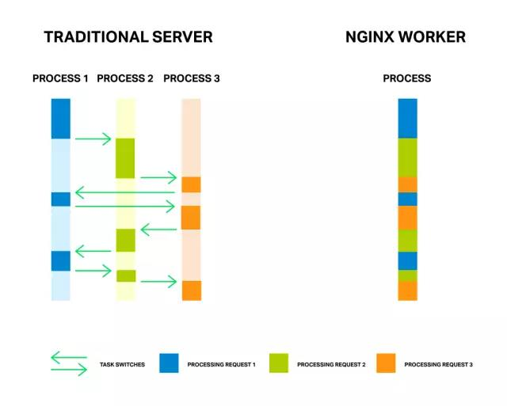

&nbsp;&nbsp;&nbsp;&nbsp;提升Web应用的性能从未像今天这样刻不容缓。在线经济活动的比例日益提高，就连发展中国家和地区的经济活动都已经有5%以上在线进行了。在这个超级链接、随时在线的现代世界，用户的期望也远非昔日可比。如果你的网站不能马上响应，你的应用不能立即运行，用户转身就会投奔你的竞争对手。<!-- more -->
&nbsp;&nbsp;&nbsp;&nbsp;亚马逊大约10年前的一项研究表明，页面加载时间减少1/10秒，能够使其营收增长1%。另一项近期的调查也显示，一多半受访站点所有者提到因为自己应用的性能不佳导致了收入减少或者用户流失。
&nbsp;&nbsp;&nbsp;&nbsp;一个网站到底多快才行？页面加载每花1秒钟，就会大约4%的用户走掉。排名靠前的电商站点的首次交互时间为1到3秒，这个区间的转换率最高。显而易见，Web应用性能的重要性与日俱增。
&nbsp;&nbsp;&nbsp;&nbsp;提升性能其实不难，难的是怎么看到结果。本文给出能够提升大约10倍网站性能的10个建议供大家参考。如此全面的涵盖各种性能优化技术，但这些建议可能需要nginx的一些支持。除了性能，这些建议也会涉及提升安全性。
<b style="color: orangered">建议一：使用反向代理服务器让应用更快更安全</b>
&nbsp;&nbsp;&nbsp;&nbsp;如果你的Web应用只跑在一台机器上，那要提升性能非常简单：换一台更快的，多配几个处理器，多加几条内存，磁盘阵列也要高速的。换了以后，这台机器上跑的WordPress服务器、Node.js或者java应用速度都会加快。(要是应用还会访问另一台数据库服务器，那也简单：找两台更快的机器，用更快的网络连起来就行了。)
&nbsp;&nbsp;&nbsp;&nbsp;麻烦在于，机器速度并不是问题。很多时候Web应用慢，是因为要在各种任务之间切换，一会要处理数千个连接上的用户请求，一会要向磁盘读写文件，一会又要运行应用的代码，一会又要去干别的。应用服务器因此可能出现各种状况，耗尽内存、交换文件，或者让很多请求等待一个磁盘I/O之类的任务。
&nbsp;&nbsp;&nbsp;&nbsp;除了升级硬件，其实你还可以选择另外一种完全不同的方法：加一台反向代理服务器，分担上述一些任务。反向代理服务器位于运行应用的机器之前，负责处理来自外网的请求。反向代理服务器直接连到互联网，它与应用服务器通信使用的是快速的内部网络。
&nbsp;&nbsp;&nbsp;&nbsp;反向代理服务器可以让应用服务器专注于构建页面，然后交给反向代理向外网发送，而不必理会用户与应用的交互。由于不必等待客户端的响应，应用服务器的运行速度能达到接近最有的水平。
&nbsp;&nbsp;&nbsp;&nbsp;增加反向代理服务器同时也可以为Web服务器增添灵活性。比如，假设执行某种任务的服务器过载了，那随时可以再增加一台同类的服务器；而如果这台服务器挂了，替换它也很容易。
&nbsp;&nbsp;&nbsp;&nbsp;鉴于这种灵活性，反向代理服务器往往也是其他性能优化手段的先决条件，比如：
- 负载均衡(参见“建议二”)，反向代理服务器上运行负载均衡服务，把流量平均分配给几台应用服务器。有了负载均衡，添加应用服务器根本不需要修改应用。
- 缓存静态文件(参见“建议三”)，图片或代码之类的可以直接请求的文件，都可以保存在反向代理服务中，以便直接发给客户端。这样不仅可以更快地响应请求，还能减轻应用服务器的负担，加快其运行速度。
- 保证站点安全，可以配置反向代理服务器提升其安全级别，通过它监控来快速识别和响应攻击，从而保证应用服务器安全。
&nbsp;&nbsp;&nbsp;&nbsp;Nginx专门为使用反向代理服务器做了设计，使其天然支持上述优化。由于使用事件驱动的处理机制，Nginx比传统服务器效率更高。Nginx Plus则增加了更高端的反向代理功能，如应用体检、特有的请求路由、高级缓存和售后支持。

<b style="color: orangered">建议二：增加负载均衡服务器</b>
&nbsp;&nbsp;&nbsp;&nbsp;增加负载均衡服务器相对简单，但却能显著提升站点性能和安全性。通过它把流量分配给多个服务器，就可以不必升级Web服务器了。就算应用本身写的不太好，或者难以扩展，负载均衡都可以在不做其他改变的情况下提升用户体验。
&nbsp;&nbsp;&nbsp;&nbsp;负载均衡服务器首先是一个反向代理服务器(参见“建议一”)，负责把来自互联网的请求转发给其他服务器。这里关键在于负载均衡服务器可以支持两台以上的应用服务器，使用一种选择算法在不同的服务器间分配请求。最简单的负载均衡算法是循环调度，即把新请求依次转发给可用服务器中的下一台服务器。其它算法还有把请求发给活动连接最少的服务器。Nginx Plus支持一种功能，就是把用户会话保持在同一台服务器上，叫做会话保持。
&nbsp;&nbsp;&nbsp;&nbsp;负载均衡服务器可以避免一台服务器过载而其他服务器过闲，从而极大提升性能。同时，有了它还可以让Web服务器扩容更加简单，因为可以选择比较便宜的服务器，同时保证物尽其用。
&nbsp;&nbsp;&nbsp;&nbsp;可以通过负载均衡调度的协议包括HTTP、HTTPS、SPDY、HTTP/2、WebSocket、FastCGI、SCGI、uwsgi、memcached，以及其他一些应用形式，包括基于TCP的应用和其他第四层的协议。为此，首先要分析Web应用，看性能短板在哪里，然后再确定使用哪一个。
&nbsp;&nbsp;&nbsp;&nbsp;同一台服务器或用于负载均衡的服务器也可以承担其他任务，比如SSL终止、视客户端不同支持HTTP/1/x或HTTP/2、缓存静态文件。
<b style="color: orangered">建议三：缓存静态及动态内容</b>
&nbsp;&nbsp;&nbsp;&nbsp;缓存能提升Web应用性能，因为可以更快地把内容交付给客户端。缓存的策略包括预处理内容、在较快的设备上存储内容、把内容保存在靠近客户端的地方，以及同时运用这些策略。
&nbsp;&nbsp;&nbsp;&nbsp;缓存有两种：
- 静态内容缓存，不常变化的文件，如图片(JPEG、PNG)和代码(CSS、JavaScript)，可以保存在边缘服务器中，以便快速从内容或磁盘中获取。
- 动态内容缓存，很多Web应用会为每个页面请求生成全新的HTML，把生成的每个HTML都缓存一小段时间，可能显著减少需要生成的页面总数，同时又可以保证交付的内容足够新鲜。
&nbsp;&nbsp;&nbsp;&nbsp;假设一个页面每秒被查看10次，而你缓存它1秒，那么90%针对这个页面的请求都将来自缓存。如果你单独缓存静态页面，那么及即使全新生成的页面，很可能大部分都来自缓存的内容。
&nbsp;&nbsp;&nbsp;&nbsp;缓存Web应用生成内容的技术主要分三种：
- 把内容放到离用户近的地方。离用户近，传输时间少。
- 把内容放到较快的机器上。机器快，检索速度快。
- 把内容从过度使用的机器中拿走。有时候机器会比在专注执行特定任务时慢很多，那是因为太多任务让它们分心。这时候把内容拿到其他机器上，不仅对缓存的内容有好处，对非缓存的内容同样有利，因为托管他们的主机的负担减轻了。
&nbsp;&nbsp;&nbsp;&nbsp;Web应用的缓存可以在Web应用服务器或外部实现。首先，考虑缓存动态内容，以减轻应用服务器的负载。其次，缓存用于静态内容(包括那些动态生成内容的临时副本)，进一步减轻应用服务器的负担。然后，考虑把缓存转移到其他更快或更靠近用户的机器，给应用服务器减负，缩短传输时间。
&nbsp;&nbsp;&nbsp;&nbsp;用好缓存能显著加快应用的响应速度。对很多网页来说，大图片之类的静态数据，往往占据一半以上的内容。不用缓存，查询和传输这类数据可能会花好几秒钟，而用缓存，则可能只要花几分之一秒。
&nbsp;&nbsp;&nbsp;&nbsp;可以举一个例子来说明怎么使用缓存，Nginx跟Nginx plus通过两个指令来设置缓存：proxy_cache_path和proxy_cache指定缓存的位置和大小、最长缓存时间以及其他参数。使用第三个(也是很受欢迎的)指令proxy_cache_use_stale，甚至可以告诉缓存在本来应该提供新鲜内容的服务器太忙或宕机时，提供原来的旧文件，对客户端来说，拿到内容总比拿不到强。从用户角度看，这样也可以树立你的站点或应用非常稳定的形象。
&nbsp;&nbsp;&nbsp;&nbsp;Nginx Plus支持高级缓存功能，包括缓存净化(caching purging)和通过控制板以可视化的形式展示缓存状态，实现实时监控。
<b style="color: orangered">建议四：压缩数据</b>
&nbsp;&nbsp;&nbsp;&nbsp;压缩同样能极大提升性能。图片、视频、音乐等文件都有非常成熟和高效的压缩标准(JPEG和PNG、MPEG-4、MP3)，任何一个标准都可以把文件大小缩小一个数量级甚至更多。
&nbsp;&nbsp;&nbsp;&nbsp;文本文件，包括HTML(纯文本和HTML标签)、CSS和JavaScript代码，经常在不压缩的情况下传输。压缩这些数据对提升Web应用的感知性能有时候特别明显，尤其是移动用户的网络很慢又不稳定的情况下。
&nbsp;&nbsp;&nbsp;&nbsp;因为文本数据通过页面交互能够起到必要的支援作用，而多媒体数据则更多是锦上添花的作用。聪明的内容压缩可以把HTML、JavaScript、CSS等文本内容缩小30%以上，因此能够响应的减少加载时间。
&nbsp;&nbsp;&nbsp;&nbsp;如果你使用SSL，压缩又可以减少必须经过SSL编码的数据量，从而补偿了压缩这些数据的CPU时间。
&nbsp;&nbsp;&nbsp;&nbsp;压缩数据的方法非常多。比如，建议六中关于HTTP/2的部分就描述了一个新颖的压缩思路，特别适合首部数据压缩。还有一个关于文本压缩的例子，就是可以在Nginx中开启GZIP压缩。预压缩文本数据之后，可以使用gzip_static指令直接发送.gz文件。
<b style="color: orangered">建议五：优化SSL/TLS</b>
&nbsp;&nbsp;&nbsp;&nbsp;越来越多的网站在使用Secure Sockets Layer(SSL)及后来的Transport Layer Security(TLS)协议。SSL/TLS通过加密从源服务器发送给用户的数据来提升网站安全性。Google会提升使用SSL/TLS的网站的搜索引擎排名，将有力地推动这一进程。
&nbsp;&nbsp;&nbsp;&nbsp;尽管采用率越来越高，但SSL/TLS造成的性能损失也困扰着很多网站。SSL/TLS拖慢网站的原因有两个：
&nbsp;&nbsp;&nbsp;&nbsp;&nbsp;&nbsp;&nbsp;&nbsp;1.每次打开新连接的初次握手都必须创建加密密钥，而浏览器使用HTTP/1.x对每个服务器建立多个连接的方式进一步加剧了这个问题。
&nbsp;&nbsp;&nbsp;&nbsp;&nbsp;&nbsp;&nbsp;&nbsp;2.服务器端加密数据和客户端解密数据的操作同样也是开销。
&nbsp;&nbsp;&nbsp;&nbsp;为了鼓励人们使用SSL/TLS，HTTP/2和SPDY(参见建议六)的作者将这两个协议设计为只让浏览器针对一次会话建立一个连接。这样就把SSL导致性能降低的两个主要原因之一消灭掉了。然而，说到优化SSL/TLS性能，还有很多事情可做。
&nbsp;&nbsp;&nbsp;&nbsp;优化SSL/TLS的方法因Web服务而异。以Nginx为例，Nginx使用OpenSSL,运行于普通机器上，能够提供接近定制机器的性能。Nginx SSL performance详细介绍了如何将SSL/TLS加密和解密的开销降至最低。
&nbsp;&nbsp;&nbsp;&nbsp;简单总结一下，涉及的技术主要有如下几种：
- 会话缓存。使用ssl_session_cache指定开启缓存，缓存每次SSL/TLS连接时用到的参数。
- 会话票或ID。把特定SSL/TLS会话的信息保存为一个会话票或ID，以便连接重用，而不必重新握手。
- OCSP封套。通过缓存SSL/TLS证书信息减少握手时间。
&nbsp;&nbsp;&nbsp;&nbsp;Nginx和Nginx Plus都可以来终止SSL/TLS，即处理客户端信息的加密和解密，同时与其他服务器保持明文通信。在Nginx或Nginx Plus中设置处理SSL/TLS终止可以采取这几个步骤。而对于在接受TCP连接的服务器上使用Nginx Plus而言，可以参考这里的设置步骤。
<b style="color: orangered">建议六：实现HTTP/2或SPDY</b>
&nbsp;&nbsp;&nbsp;&nbsp;已经使用SSL/TLS的站点，如果再使用HTTP/2或SPDY则很可能提升性能，因为一个连接主要一次握手。尚未使用SSL/TLS、HTTP/2和SPDY的站点切换到SSL/TLS(通常会降低性能)，从响应速度方面看，可能是一次倒退。
&nbsp;&nbsp;&nbsp;&nbsp;谷歌2012年开始SPDY项目，致力于在HTTP/1.x之上实现更快的速度。HTTP/2则是IETE最近批准的基于SPDY的标准。SPDY得到了广泛支持，但很快就将被HTTP/2取代。
&nbsp;&nbsp;&nbsp;&nbsp;SPDY和HTTP/2的关键在于只用一个连接，而非多个连接。这一个连接是多路复用的，因此可以同时承载多个请求和响应。只维持一个连接，可以省掉多个连接所需的设置和管理消耗。而且一个连接对SSL特别重要，因为可以将SSL/TLS建立安全连接所需的握手时间降至最少。
&nbsp;&nbsp;&nbsp;&nbsp;SPDY协议要求使用SSL/TLS，HTTP/2并没有正式要求，但目前所有支持HTTP/2的浏览器都只会在启用SSL/TLS的情况下才会使用它。换句话说，支持HTTP/2的浏览器只有在网站使用SSL且服务器接受HTTP/2流量的情况下才会使用HTTP/2。否则，浏览器只会基于HTTP/1.x通信。
&nbsp;&nbsp;&nbsp;&nbsp;实现了SPDY或HTTP/2之后，域名分片、资源合并、图片精灵等之前针对HTTP的性能优化措施就用不着了。因此可以简化代码和部署。
&nbsp;&nbsp;&nbsp;&nbsp;Nginx很早就开始支持SPDY，而且今天使用SPDY的大多数站点都在运行Nginx。Nginx同样率先支持了HTTP/2，2015年9月，Nginx开源和Nginx plus开始支持HTTP/2。
&nbsp;&nbsp;&nbsp;&nbsp;随着时间推移，Nginx希望大多数站点启用SSL并迁移到HTTP/2。这样不仅可以让网站更安全，而且随着新的优化技术不断涌现，也可以通过简单的代码实现更高的性能。
<b style="color: orangered">建议七：升级软件</b>
&nbsp;&nbsp;&nbsp;&nbsp;提升应用性能的一个简单的方法，就是根据可靠性及性能选择软件。此外，高质量组件的开发者更可能不断提升性能和修复问题，因此使用最新的稳定版本是划算。新发布的版本会得到开发者和用户更多的关注，同时也会利用新的编译器优化技术，包括针对新硬件的调优。
&nbsp;&nbsp;&nbsp;&nbsp;相对旧版本，新发布的稳定版本明显性能更高。坚持升级，也可以保证在调优、问题修复和安全警报方面与时俱进。
&nbsp;&nbsp;&nbsp;&nbsp;不升级软件也会妨碍利用新能力。比如，HTTP/2目前要求OpenSSL 1.0.1。从2016年下半年开始，HTTP/2会要求OpenSSL 1.0.2，该版本发布于2015年10月。
&nbsp;&nbsp;&nbsp;&nbsp;Nginx用户可以从Nginx开源软件的最新版本或Nginx Plus开始，他们支持套接字共享、线程池，而且都会持续优化性能。因此，坚持一下自己的软件，尽量把他们升级到最新的版本。
<b style="color: orangered">建议八：调优Linux</b>
&nbsp;&nbsp;&nbsp;&nbsp;Linux是今天大多数Web服务器的底层操作系统，作为一切基础设施的基础，Linux对性能提升至关重要。默认情况下，很多Linux系统都比较保守，仅以桌面办公为需求，以占用少量资源为调优目标。对于Web应用而言，为达到性能最佳，肯定需要重新调优。
&nbsp;&nbsp;&nbsp;&nbsp;Linux优化因Web服务器而异。以Nginx为例，可以从以下几个方面考虑：
- 存量队列。如果发现一些连接得不到处理，可以增大net.core.somaxconn，即等待Nginx处理的最大连接数。如果这个连接数限制过小，应该可以看到错误信息，可以逐步提高这个值，直到错误消息不再出现。
- 文件描述符。Nginx对每个连接最多使用两个文件描述符。如果系统服务于很多连接，可能需要增大sys.fs.file_max这个对描述符的系统级限制，以及nofile这个用户文件描述符限制，以支持增大后的负载。
- 临时端口。在作为代理使用时，Nginx会为每个上游服务器创建临时端口。可以设置net.ipv4.ip_local_port_range，增大端口值的范围，以增加可用的端口量。此外，还可以减少net.ipv4.tcp_fin_timeout的值，它控制非活动端口释放重用的等待时间，加快周转。
- 对nginx而言，请参考nginx性能调优指南，了解如何不费吹灰之力将你的nginx系统优化为能够支持更大的吞吐量。
<b style="color: orangered">建议九：调优Web服务器</b>
&nbsp;&nbsp;&nbsp;&nbsp;无论使用什么Web服务器，都需要针对应用对其调优。以下建议适用于任何Web服务器，但会给出只有Nginx的设置说明。
- 访问日志。不要每个请求的日志都马上写到磁盘，可以在内存里做个缓存，然后批量写入。对Nginx而言，将buffer=_size_参数添加到access_log指令，等内存缓冲区写满后再把日志写到磁盘。如果你添加了**flush=_time_**参数，那么缓冲区的内容也会按照指定时间写入磁盘。
- 缓冲。缓冲用于在内存里保存部分响应，直到缓冲区被填满，可以实现对客户端更有效的响应。无法写入内存的响应会被写到磁盘，从而降低性能。在Nginx的缓冲启用时，可以使用proxy_buffer_size和proxy_buffers指令来管理它。
- 客户端活动连接。活动连接可以减少时间消耗，特别是在使用SSL/TLS的情况下。对Nginx而言，可以针对客户端提高keepalive_requests的数值，默认值为100；也可以增大keepalive_timeout的值，让活动连接持续时间更长，从而让后续请求得到更快响应。
- 上游活动连接。上游连接，即连接到应用服务器、数据库服务器的连接，同样可以从活动连接的设置中获得好处。对上游连接来说，可以增加活动连接，也就是每个工作进程可用的空闲活动连接的数量。这样可以增进连接重用，减少重开连接。
- 限制。限制客户端使用的资源可以提升性能和安全性。对Nginx而言，limit_conn和limit_conn_zone指令限制指定源的连接数，而limit_rate限制宽带。这些设置可以防止合法用户“侵吞”资源，同时也有助于防止攻击。limit_req和limit_req_zone指令限制客户端请求。对于到上游服务器的连接，可以在上游配置区的服务器指令中使用max_conns参数，它限制对上游服务器的连接，防止过载。相关的队列指令会创建一个队列，在max_conns限制到达后将指定的请求保存指定的时间。
- 工作进程。工作进程负责处理请求。Nginx采用基于事件的模型和OS相关的机制有效地在工作进程间分配请求。建议将worker_processes的值设置为每个CPU一个工作进程。如果需要，大多数系统都支持提高worker_connections的值。(默认为512)，可以通过试验找到最适合你系统的这个值。
- 套接字分片。通常，一个套接字监听器向所有工作进程分发新连接。套接字分片则为每个工作进程都创建一个套接字监听器，由内核在套接字监听器可用时为其指定连接。这样可以减少锁争用，提升多核系统上的性能。要启用套接字分片，在listen指令中包含reuseport参数。
- 线程池。一个费时的操作会阻塞任何计算机进程。对Web服务器软件来说，磁盘访问可能阻碍很多较快的任务，比如内存中的计算和复制。在使用线程池的情况下，慢操作会被指定给一组独立的任务，而主处理循环会继续运行较快的操作。磁盘操作完成后，结果会返回到主处理循环。在Nginx中，read()系统调用和sendfile()被转载到了线程池。
&nbsp;&nbsp;&nbsp;&nbsp;提示：修改任何操作系统及周边设备的设置时，每次只修改一项，然后测试性能。如果该项修改导致了问题，或者未提升性能，再改回去。
<b style="color: orangered">建议十：监控实时动态以发现问题和瓶颈</b>
&nbsp;&nbsp;&nbsp;&nbsp;保存应用高性能的关键是监控应用性能。必须实时监控特定设备及相应Web基础设施中应用的动态。
&nbsp;&nbsp;&nbsp;&nbsp;监控站点活动多数情况下是被动的，它只告诉你发生了什么，至于如何发现和解决问题，则是你自己的事情。
&nbsp;&nbsp;&nbsp;&nbsp;监控可以捕获以下几种问题：
&nbsp;&nbsp;&nbsp;&nbsp;&nbsp;&nbsp;&nbsp;&nbsp;1.服务器停机。
&nbsp;&nbsp;&nbsp;&nbsp;&nbsp;&nbsp;&nbsp;&nbsp;2.服务器不稳，漏处理连接。
&nbsp;&nbsp;&nbsp;&nbsp;&nbsp;&nbsp;&nbsp;&nbsp;3.服务器出现大面积缓存失效。
&nbsp;&nbsp;&nbsp;&nbsp;&nbsp;&nbsp;&nbsp;&nbsp;4.服务器发送的内容不对。
&nbsp;&nbsp;&nbsp;&nbsp;New Relic或Dynatrace等全局性的性能监控工具，可以帮我们监控远程加载页面的时候，而Nginx则可以帮你监控应用交付这一端。应用的性能数据可以告诉你优化手段什么时候真正给用户带去了不同的体验。以及什么时候需要扩容以满足越来越多的流量。
&nbsp;&nbsp;&nbsp;&nbsp;为了帮助用户尽快发现问题，Nginx Plus增加了应用程序体检功能，会报告经常重复出现的问题。Nginx Plus还具备session draining特性，会在已有任务完成前阻止连接，以及慢启动容量，从而让恢复的服务器在负载均衡集群中达到应有的速度。使用得当的情况下，健康体检会在问题显著影响用户体验之前帮你定位问题，而session draining和慢启动则让你替换服务时不影响感知的性能和在线时间。
<b style="color: orangered">结论：</b>
&nbsp;&nbsp;&nbsp;&nbsp;性能提升引web应用不同会有巨大差异。实际的提升取决于预算、时间，以及现有实现的与理想性能的差距。那么怎么让你的应用获得10倍的性能提升呢？
&nbsp;&nbsp;&nbsp;&nbsp;为了帮大家理解每项优化建议的潜能，下面再针对之前的建议给出一些实时方针，希望大家各取所需。
- 反向代理服务器及负载均衡。没有负载均衡或池负载均衡，可能导致极低的性能。添加一个反向代理服务器，比如Nginx，可以减少Web应用在内存和磁盘之间的往返。负载均衡可以把任务从过载的服务器转移到空闲的服务器，也便于扩展。这些改变能极大地提升性能，与原有的部署方式最差的时候相比，10倍性能提升还是很轻松的事，即使不到10倍那也在总体上有了质的飞跃。
- 缓存动态和静态内容。如果你的Web服务器同时又充当了应用服务器，那么通过缓存动态内容就可以达到高峰期10倍的性能提升。缓存静态内容也可以有几倍的性能提升。
- 压缩数据。使用JPEG、PNG、MPEG-4以及MP3等压缩格式能显著提升性能。如果这些手段都用上了，那么压缩的文本数据(代码及HTML)可以将初始化页面加载时间提升两倍。
- 优化SSL/TLS。安全握手对性能有很大影响，因此对其进行优化可以让初次响应加快两倍，对于文本内容较多的网站尤其如此。优化SSL/TLS下的媒体文件带来的性能提升很小。
- 实施HTTP/2和SPDY。在使用SSL/TLS的情况下，这两个协议有可能提升网站的整体性能。
- 调优Linux和Web服务器。使用优化的缓存策略、使用活动连接，将耗时的任务转载至独立的线程池，可以显著提升性能。比如线程池可以将磁盘操作密集性任务的性能提升至少一个数量级。