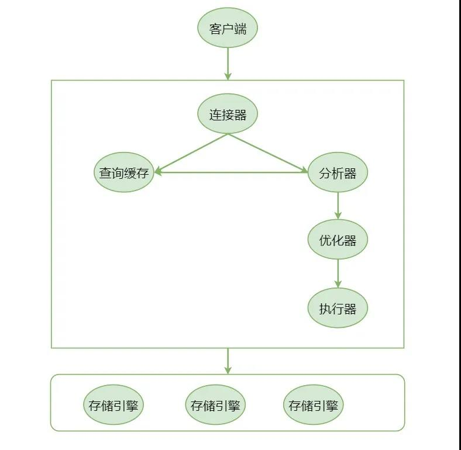

&nbsp;&nbsp;&nbsp;&nbsp;首先咱们先来看一张图，接下来的过程都是基于这张图来讲的。
<!-- more -->
<b style="color: orangered">连接器</b>
&nbsp;&nbsp;&nbsp;&nbsp;当客户端连接连接MySQL时，会发出连接请求到连接器，连接器此时就会去验证这个连接的账号密码。
- 如果账号或密码不正确，客户端就会收到一个Access denied for user的错误，之后此次连接结束。
- 账号密码正确，连接器会到权限表里面查询出该账号所拥有的权限，之后这个连接里面的权限判断，都是以此时读到的权限为根据。
&nbsp;&nbsp;&nbsp;&nbsp;所以你知道为什么更改一个账号的权限之后，一定要断开再重连才有效把。
&nbsp;&nbsp;&nbsp;&nbsp;在实际中肯定有这样的情况，就是一个连接建立之后，但是我没有执行什么操作，那么就可以说这个连接处于空闲状态(sleep)。如果长时间都没有什么操作的话，连接器就会选择把它断开，这个时间是由wait_timeout来控制的，默认值是8小时。连接都被断开了，如果此时客户端再次发送请求想要进行一些操作的话，那就需要重新建立连接才能往下走。在数据库中有两种连接：
- 短连接：每次执行完很少的几次查询就断开连接，下次想查询时，就要重新建立一个。
- 长连接：如果客户端持续有请求，那就一直使用同一个连接。
&nbsp;&nbsp;&nbsp;&nbsp;建立连接是比较麻烦的，首先要发送请求，发送了请求要去验证账号密码，验证完了要去看账号所拥有的权限，所以在使用过程中，尽量使用长连接。但是使用长连接又有新的问题：有时候，你会发现MySQL占用内存，因为是长连接，所以它会在断开的时候才将资源释放。这个时候可以考虑下面两种方案：
- 定期断开长连接。
- 如果使用的是MySQL 5.7或者更高的版本，可以在每次执行一个比较大的操作之后，通过执行mysql_reset_connection来重新初始化连接资源，这个过程不需要重新连接和权限验证。
<b style="color: orangered">分析器</b>
&nbsp;&nbsp;&nbsp;&nbsp;连接器这一关是过来了，接下来就是去查询缓存。首先看缓存里面有没有，如果有，那就没必要向下走，直接返回给客户端结果就可以了。如果缓存中没有的话，那就去分析器。
&nbsp;&nbsp;&nbsp;&nbsp;但是聪明的你肯定发现了，我的小标题并不是缓存，而是分析器，为什么呢？因为查询缓存的失效非常频繁，只要有对一个表的更新，那在这个表上的所有查询缓存都会被清空。所以就会导致MySQL费劲地把缓存给建立起来，结果还没怎么用，一个更新操作，给弄没了。所以MySQL 8.0版本直接将查询缓存的整块功能都给删掉了。
&nbsp;&nbsp;&nbsp;&nbsp;分析器首先会进行"词法分析"，词法分析就是select * from T where id = 1;它会将select识别出来，这是一个查询语法，接下来会将T也识别出来，哦，你是想要在这个表中做查询，然后将where后面的条件也识别出来，原来我需要去查找这些内容。
&nbsp;&nbsp;&nbsp;&nbsp;OK，"词法分析"之后，接下来是"语法分析"，语法分析主要就是分析输入的SQL语句合不合法。就比如英语里面的语法“我用is，你用are”这种，如果不对肯定是不可以的，语义分析之后发现你的SQL语句不符合规则，就会收到You hava an error in your SQL syntax的错误提示。
<b style="color: orangered">优化器</b>
&nbsp;&nbsp;&nbsp;&nbsp;经过分析器分析之后，MySQL知道你要的是什么了。但是就像条条大路通罗马一样，看似是一条简单的SQL查询语句，有可能有好多条执行路径可以走，比如说要查询的表里面有多个索引，我使用哪个索引效率会比较高；多表查询的时候，我先关联哪个表效率会比较高。像这种就是优化器需要做的事情。
<b style="color: orangered">执行器</b>
&nbsp;&nbsp;&nbsp;&nbsp;优化器做完优化之后，就到了执行器。执行器就是要去执行语句，肯定要看看对于要查询的表T有没有查询权限，如果没有直接就拒绝；如果有的话，那就会这样：
- 调用InnoDB引擎接口取这个表的第一行，判断ID的值是不是1，如果不是就跳过，如果是那就放在结果集中；
- 调用引擎接口取"下一行"，重复相同的判断逻辑，直到这个表的最后一行；
- 执行器将上述遍历过程中所有满足条件的行，组成记录集返回给客户端。
&nbsp;&nbsp;&nbsp;&nbsp;至此，语句执行结束。
<b style="color: orangered">存储引擎</b>
&nbsp;&nbsp;&nbsp;&nbsp;select * from T where name='A' and age = 18;还记得MySQL首先会怎么做？
- 通过连接器查询当前执行者的角色是否有权限，进行查询。如果有的话，就继续往下走，如果没有的话，抛出Access denied for user的错误信息。
- 接下来就是分析器来分析语句，继续向下执行吧。
- 此时来到了优化器，优化器就想，这条执行语句，有两种执行方案：
   - 先查询表T中姓名为A的，然后再判断他年龄是不是18岁
   - 先查询表T中年龄为18岁的所有人，然后再从里面找到姓名为A的
- 等优化器决定选择哪个方案之后，执行器就去执行了。然后返回给客户端结果。