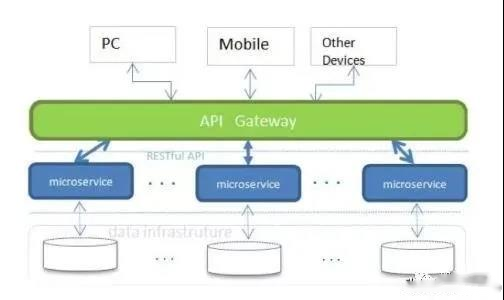

<b style="color: orangered">前言</b>
&nbsp;&nbsp;&nbsp;&nbsp;在服务做微服务改造后，原先单库join查询已经不能满足要求，每个拆分的微服务对应一个数据库实例，而且部署在不同的服务器上，那么解决“跨库查询”就势在必行了。

&nbsp;&nbsp;&nbsp;&nbsp;以下几个思路仅供参考：<!-- more -->
<b style="color: orangered">一.表字段冗余</b>
&nbsp;&nbsp;&nbsp;&nbsp;想必大家已经很熟悉，几乎每天都会打交道，不用多讲。
&nbsp;&nbsp;&nbsp;&nbsp;需要指出的是<b style="color: #CC3299">冗余字段不能太多，建议控制在2-4个左右。否则会出现数据更新不一致问题，一旦冗余字段有改动，极容易产生脏数据。</b>
&nbsp;&nbsp;&nbsp;&nbsp;<b style="color: #6A6AFF">解决思路</b>
&nbsp;&nbsp;&nbsp;&nbsp;&nbsp;&nbsp;&nbsp;&nbsp;建立同步机制，必要时采取人工补偿措施。
&nbsp;&nbsp;&nbsp;&nbsp;所以合理的字段冗余是润滑剂，减少join关联查询，让数据库执行性能更高更快。
<b style="color: orangered">二.聚合服务封装查询</b>
&nbsp;&nbsp;&nbsp;&nbsp;<b style="color: #6A6AFF">聚合服务：</b>简单来说，就是把不同服务的数据统一组装在一个新的服务里做聚合，对外提供统一入口API接口查询。
&nbsp;&nbsp;&nbsp;&nbsp;开发新闻报表查询接口时，需要用到用户、新闻、用户标签、登记记录等数据。但是用户、新闻、登记记录在不同的数据库，而且还不在同一台服务器上。把代码写在用户微服务或者新闻微服务都不合适，最后只能自己单独写一个聚合服务来解决跨库查询数据问题。
&nbsp;&nbsp;&nbsp;&nbsp;<b style="color: #CC3299">聚合服务的数据组装是以API接口调用来实现，一般不建议直连数据库连表查询。</b>这样做的好处是减少服务间调用次数以及查询库表压力。
&nbsp;&nbsp;&nbsp;&nbsp;在实际的业务开发中，我们经常碰到类似的需求，而聚合服务不失为一种较彻底的服务解耦实现方式。
<b style="color: orangered">三.表视图查询</b>
&nbsp;&nbsp;&nbsp;&nbsp;如果涉及到不同数据库表之间的join查询，可以在其中某一数据库的表上建立视图(view)关系，这种方式非常高效，只需要开发一个简单接口对外提供服务就可以了，而且省去聚合服务带来调用、查询、聚合的复杂性。
&nbsp;&nbsp;&nbsp;&nbsp;<b style="color: #6A6AFF">前提条件：</b>
&nbsp;&nbsp;&nbsp;&nbsp;&nbsp;&nbsp;&nbsp;&nbsp;1.数据库需要部署在同一台服务器上
&nbsp;&nbsp;&nbsp;&nbsp;&nbsp;&nbsp;&nbsp;&nbsp;2.数据库账号密码必须相同，也就是在同一个schema下
&nbsp;&nbsp;&nbsp;&nbsp;另外表视图查询这种方式，是一种紧耦合的设计方式，不利于程序扩展，除非你很确定将来业务变动不大，可以考虑使用。不适合大规模使用。
<b style="color: orangered">四.多数据源查询</b>
&nbsp;&nbsp;&nbsp;&nbsp;这种方式是一种比较技术化的思路，简单来说就是一个微服务配置多个数据库源(DataSource),数据源来回切换进行库表查询，以达到获取不同数据的目的。
&nbsp;&nbsp;&nbsp;&nbsp;<b style="color: #6A6AFF">实现思路：</b>
&nbsp;&nbsp;&nbsp;&nbsp;&nbsp;&nbsp;&nbsp;&nbsp;1.利用DynamicDataSource
&nbsp;&nbsp;&nbsp;&nbsp;&nbsp;&nbsp;&nbsp;&nbsp;2.利用Spring的AOP动态切换数据源
&nbsp;&nbsp;&nbsp;&nbsp;&nbsp;&nbsp;&nbsp;&nbsp;3.利用Spring的依赖注入方式管理Bean数据源对象
&nbsp;&nbsp;&nbsp;&nbsp;具体实现方式，网上例子很多很成熟的实现方案。
<b style="color: #6A6AFF">五.分库分表：使用数据库中间件</b>
&nbsp;&nbsp;&nbsp;&nbsp;<b style="color: #6A6AFF">Sharding-Shpere</b>
&nbsp;&nbsp;&nbsp;&nbsp;&nbsp;&nbsp;&nbsp;&nbsp;想必做过分库分表的同学对他一定不陌生，其出身来自当当开源项目sharding-jdbc。非常有限的跨库查询解决方案，目前在京东内部已经广泛使用。
&nbsp;&nbsp;&nbsp;&nbsp;&nbsp;&nbsp;&nbsp;&nbsp;sharding-jdbc创始人张亮已加入京东，sharding-jdbc还在不停的迭代，目前更名为sharding-shpere，已经入Apache顶级项目，进行孵化，非常看好它。

&nbsp;&nbsp;&nbsp;&nbsp;<b style="color: #6A6AFF">Mycat</b>
&nbsp;&nbsp;&nbsp;&nbsp;&nbsp;&nbsp;&nbsp;&nbsp;一个彻底开源的，面向企业应用开发的大数据库集群，支持事务、ACID、可以替代MySQL的加强版数据库；一个可以视为MySQL集群的企业级数据库，用来替代昂贵的Oracle集群；一个融合内存缓存技术、NoSQL技术、HDFS大数据的新型SQL server；结合传统数据库和新型分布式数据仓库的新一代企业级数据库产品；一个新颖的数据库中间件产品。

&nbsp;&nbsp;&nbsp;&nbsp;&nbsp;&nbsp;&nbsp;&nbsp;<b style="color: #00FFFF">Mycat关键特性</b>
&nbsp;&nbsp;&nbsp;&nbsp;&nbsp;&nbsp;&nbsp;&nbsp;&nbsp;&nbsp;&nbsp;&nbsp;1.遵守Mysql原生协议，跨语言，跨平台，跨数据库的通用中间件代理。
&nbsp;&nbsp;&nbsp;&nbsp;&nbsp;&nbsp;&nbsp;&nbsp;&nbsp;&nbsp;&nbsp;&nbsp;2.支持单库内部任意join，支持跨库两表join，甚至基于caltlet的多表join。
&nbsp;&nbsp;&nbsp;&nbsp;&nbsp;&nbsp;&nbsp;&nbsp;&nbsp;&nbsp;&nbsp;&nbsp;3.支持通过全局表，ER关系的分片策略，实现了高效的多表join查询。